# Zavat feed - 2026-09-03

---

**Time:** 03:55:58 (Asia/Tehran)  
**Blog:** AvaxGenius  

**Title:** The Scientist 2024 Full Year Collection  

**Details:** English | True PDF | 4 Issues | 117.7 MB  

**Link:** http://zavat.pw/magazines/TheScientist2024FullYearCollection.html  

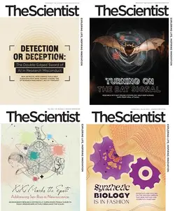

---

**Time:** 03:55:58 (Asia/Tehran)  
**Blog:** AvaxGenius  

**Title:** Energietechnik (Repost)  

**Details:** Deutsch | EPUB (True) | 2022 | 849 Pages | ISBN : 3658348305 | 111.1 MB  

**Link:** http://zavat.pw/ebooks/364583483055.html  

---

**Time:** 03:55:58 (Asia/Tehran)  
**Blog:** AvaxGenius  

**Title:** Non-Pushing PCI Techniques (Repost)  

**Details:** English | PDF | 2021 | 282 Pages | ISBN : 9811570426 | 108.46 MB  

**Link:** http://zavat.pw/ebooks/984115705426.html  

---

**Time:** 03:55:58 (Asia/Tehran)  
**Blog:** AvaxGenius  

**Title:** Atlas of Pediatric and Youth ECG (Repost)  

**Details:** English | PDF | 2018 | 382 Pages | ISBN : 331957101X | 101.9 MB  

**Link:** http://zavat.pw/ebooks/33195754101X.html  

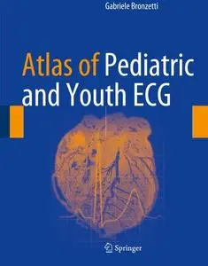

---

**Time:** 03:55:58 (Asia/Tehran)  
**Blog:** AvaxGenius  

**Title:** Diagnostic Imaging of Mediastinal Diseases (Repost)  

**Details:** English | EPUB | 2021 | 276 Pages | ISBN : 9811599297 | 342.7 MB  

**Link:** http://zavat.pw/ebooks/981415599297.html  

---

**Time:** 03:55:58 (Asia/Tehran)  
**Blog:** AvaxGenius  

**Title:** Lehrbuch für digitales Fertigungsmanagement: Manufacturing Execution Systems - MES (Repost)  

**Details:** Deutsch | EPUB | 2021 | 271 Pages | ISBN : 3662632012 | 218.7 MB  

**Link:** http://zavat.pw/ebooks/366254632012.html  

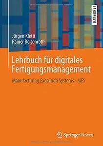

---

**Time:** 03:55:58 (Asia/Tehran)  
**Blog:** AvaxGenius  

**Title:** Peri-Implant Complications: A Clinical Guide to Diagnosis and Treatment (Repost)  

**Details:** English | PDF,EPUB | 2018 | 122 Pages | ISBN : 3319637177 | 101.21 MB  

**Link:** http://zavat.pw/ebooks/331946357177.html  

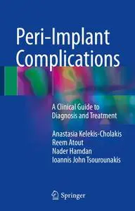

---

**Time:** 03:55:58 (Asia/Tehran)  
**Blog:** AvaxGenius  

**Title:** Suicide by Proxy in Early Modern Germany: Crime, Sin and Salvation (Repost)  

**Details:** English | EPUB (True) | 2023 | 480 Pages | ISBN : 3031252438 | 112.3 MB  

**Link:** http://zavat.pw/ebooks/303312524384.html  

---

**Time:** 03:55:58 (Asia/Tehran)  
**Blog:** AvaxGenius  

**Title:** Form, Space and Design: From the Persian to the European Experience (Repost)  

**Details:** English | EPUB | 2020 | 148 Pages | ISBN : 3030158306 | 147.3 MB  

**Link:** http://zavat.pw/ebooks/303015458306.html  

---

**Time:** 03:55:58 (Asia/Tehran)  
**Blog:** AvaxGenius  

**Title:** Handbook of Digital Face Manipulation and Detection: From DeepFakes to Morphing Attacks (Repost)  

**Details:** English | EPUB | 2022 | 481 Pages | ISBN : 3030876632 | 99.4 MB  

**Link:** http://zavat.pw/ebooks/303508762632.html  

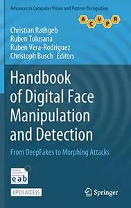

---

**Time:** 03:55:58 (Asia/Tehran)  
**Blog:** AvaxGenius  

**Title:** Recent Advances in Computer Vision: Theories and Applications (Repost)  

**Details:** English | EPUB(True) | 2019 | 430 Pages | ISBN : 3030029999 | 118 MB  

**Link:** http://zavat.pw/ebooks/303040529999.html  

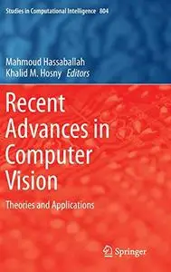

---

**Time:** 03:55:58 (Asia/Tehran)  
**Blog:** AvaxGenius  

**Title:** Facing the Challenges in Structural Engineering (Repost)  

**Details:** English | PDF | 2018 | 513 Pages | ISBN : 3319619136 | 103.7 MB  

**Link:** http://zavat.pw/ebooks/331396191365.html  

---

**Time:** 03:55:58 (Asia/Tehran)  
**Blog:** AvaxGenius  

**Title:** A Brief History of Chinese Design Thought (Repost)  

**Details:** English | PDF,EPUB | 2022 | 279 Pages | ISBN : 9811694079 | 104.2 MB  

**Link:** http://zavat.pw/ebooks/981169405479.html  

---

**Time:** 03:55:58 (Asia/Tehran)  
**Blog:** AvaxGenius  

**Title:** A Combined Data and Power Management Infrastructure: For Small Satellites, Second Edition (Repost)  

**Details:** English | EPUB (True) | 2021 | 459 Pages | ISBN : 366264052X | 143.2 MB  

**Link:** http://zavat.pw/ebooks/36654264052X.html  

---

**Time:** 03:55:58 (Asia/Tehran)  
**Blog:** AvaxGenius  

**Title:** The Root Canal Anatomy in Permanent Dentition (Repost)  

**Details:** English | EPUB | 2019 | 431 Pages | ISBN : 3319734431 | 280.9 MB  

**Link:** http://zavat.pw/ebooks/331954734431.html  

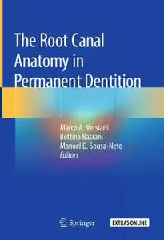

---

**Time:** 01:43:17 (Asia/Tehran)  
**Blog:** AvaxGenius  

**Title:** Encyclopedia of Continuum Mechanics (Repost)  

**Details:** English | PDF | 2020 | 2837 Pages | ISBN : 3662558777 | 95.21 MB  

**Link:** http://zavat.pw/ebooks/366254558777.html  

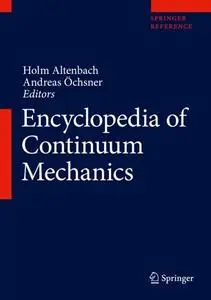

---

**Time:** 01:43:17 (Asia/Tehran)  
**Blog:** AvaxGenius  

**Title:** Musculoskeletal Ultrasound-Guided Regenerative Medicine (Repost)  

**Details:** English | EPUB (True) | 554 Pages | ISBN : 3030982556 | 214.1 MB  

**Link:** http://zavat.pw/ebooks/303309825556.html  

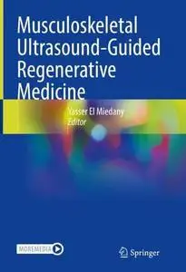

---

**Time:** 01:43:17 (Asia/Tehran)  
**Blog:** AvaxGenius  

**Title:** Color Atlas of Female Genital Tract Pathology (Repost)  

**Details:** English | EPUB (True)| 2018 (2019 Edition) | 496 Pages | ISBN : 9811310289 | 834.8 MB  

**Link:** http://zavat.pw/ebooks/981153102289.html  

---

**Time:** 01:43:17 (Asia/Tehran)  
**Blog:** hill0  

**Title:** Junqueira's Basic Histology: Text and Atlas, 17 Edition  

**Details:** English | 2024 | ISBN: 1264930399 | 1198 Pages | EPUB (True) | 234 MB  

**Link:** http://zavat.pw/ebooks/1264930399e.html  

---

**Time:** 01:43:17 (Asia/Tehran)  
**Blog:** hill0  

**Title:** Histology: Text & Atlas (3rd Edition)  

**Details:** English | 2023 | ISBN: 9395736372 | 397 Pages | PDF (True) | 275 MB  

**Link:** http://zavat.pw/ebooks/9395736372.html  

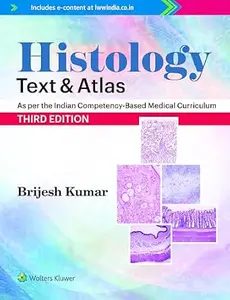

---

**Time:** 01:43:17 (Asia/Tehran)  
**Blog:** hill0  

**Title:** Bergman's Comprehensive Encyclopedia of Human Anatomic Variation  

**Details:** English | 2016 | ISBN: 1118430352 | 1455 Pages | PDF (True) | 53 MB  

**Link:** http://zavat.pw/ebooks/1118430352p.html  

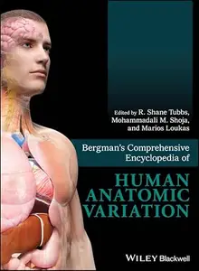

---

**Time:** 01:43:17 (Asia/Tehran)  
**Blog:** hill0  

**Title:** Essentials of General Surgery and Surgical Specialties (7th Edition)  

**Details:** English | 2025 | ISBN: 1975197526 | 1547 Pages | PDF | 124 MB  

**Link:** http://zavat.pw/ebooks/1975197526.html  

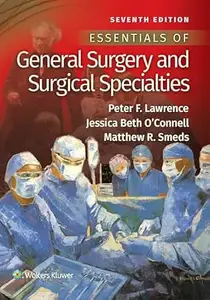

---

**Time:** 01:43:17 (Asia/Tehran)  
**Blog:** hill0  

**Title:** Retro-Games mit Python für Einsteiger  

**Details:** Deutsch | 2026 | ISBN: 3747511783 | 282 Pages | EPUB | 3.3 MB  

**Link:** http://zavat.pw/ebooks/3747511783.html  

