# Zavat feed - 2026-09-06

---

**Time:** 19:52:04 (Asia/Tehran)  
**Blog:** IrGens  

**Title:** I Shoot Rock Stars: The Wild Adventures of a Music Video Director  

**Details:** English | 13 Aug. 2026 | ISBN: 103546951, 9781035426980, 9798895152157 | True EPUB | 336 pages | 29 MB  

**Link:** http://zavat.pw/ebooks/103546951.html  

---

**Time:** 19:52:04 (Asia/Tehran)  
**Blog:** IrGens  

**Title:** Daedalus, or Science and the Future  

**Details:** English | Aug 25, 2026 | ISBN: 9789370890046 | True EPUB | 59 pages | 1.3 MB  

**Link:** http://zavat.pw/ebooks/9789370890046.html  

---

**Time:** 19:52:04 (Asia/Tehran)  
**Blog:** IrGens  

**Title:** Tree: My Encounters with Trees  

**Details:** English | September 1, 2026 | ISBN: 0063443465, 9780063443440 | True EPUB | 192 pages | 2.9 MB  

**Link:** http://zavat.pw/ebooks/0063443465.html  

---

**Time:** 19:52:04 (Asia/Tehran)  
**Blog:** IrGens  

**Title:** The Distance Between Our Names: The Untold History of America's War on Japanese Immigrants  

**Details:** English | September 1, 2026 | ISBN: 1668031183, 9781668031209 | True EPUB | 288 pages | 36.7MB  

**Link:** http://zavat.pw/ebooks/1668031183.html  

---

**Time:** 19:52:04 (Asia/Tehran)  
**Blog:** IrGens  

**Title:** AI Agents in Action, Second Edition, Video Edition  

**Details:** .MP4, AVC, 1920x1080, 15 fps | English, AAC, 2 Ch | 9h 59m | 2.57 GB  

**Link:** http://zavat.pw/ebooks/9781633434530VE.html  

---

**Time:** 19:52:04 (Asia/Tehran)  
**Blog:** hill0  

**Title:** Security Architecture  

**Details:** English | 2025 | ISBN: 1780177143 | 230 Pages | True PDF | 11 MB  

**Link:** http://zavat.pw/ebooks/1780177143p.html  

---

**Time:** 16:31:08 (Asia/Tehran)  
**Blog:** hill0  

**Title:** Welding and Joining Engineering  

**Details:** English | 2026 | ISBN: 3032204615 | 305 Pages | PDF EPUB (True) | 41 MB  

**Link:** http://zavat.pw/ebooks/3032204615.html  

---

**Time:** 16:31:08 (Asia/Tehran)  
**Blog:** hill0  

**Title:** Future of the Automotive Industry  

**Details:** English | 2026 | ISBN: 3032263077 | 130 Pages | PDF EPUB (True) | 19 MB  

**Link:** http://zavat.pw/ebooks/3032263077.html  

---

**Time:** 16:31:08 (Asia/Tehran)  
**Blog:** hill0  

**Title:** Managing Technical Debt in Systems Engineering  

**Details:** English | 2026 | ISBN: 3032303591 | 262 Pages | PDF EPUB (True) | 13 MB  

**Link:** http://zavat.pw/ebooks/3032303591.html  

---

**Time:** 16:31:08 (Asia/Tehran)  
**Blog:** hill0  

**Title:** Entrepreneurship and Innovation  

**Details:** English | 2026 | ISBN: 303220996X | 299 Pages | PDF EPUB (True) | 28 MB  

**Link:** http://zavat.pw/ebooks/303220996X.html  

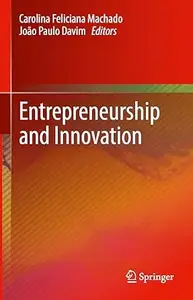

---

**Time:** 16:31:08 (Asia/Tehran)  
**Blog:** hill0  

**Title:** Healthy Aging (2nd Edition)  

**Details:** English | 2026 | ISBN: 3032219272 | 420 Pages | PDF EPUB (True) | 59 MB  

**Link:** http://zavat.pw/ebooks/3032219272.html  

---

**Time:** 16:31:08 (Asia/Tehran)  
**Blog:** hill0  

**Title:** Essential Physics of Medical X-ray Sources and Detectors  

**Details:** English | 2026 | ISBN: 303227799X | 383 Pages | PDF EPUB (True) | 54 MB  

**Link:** http://zavat.pw/ebooks/303227799X.html  

---

**Time:** 16:31:08 (Asia/Tehran)  
**Blog:** hill0  

**Title:** Ophthalmology in 1000 MCQs  

**Details:** English | 2026 | ISBN: 3032145708 | 372 Pages | PDF EPUB (True) | 7 MB  

**Link:** http://zavat.pw/ebooks/3032145708.html  

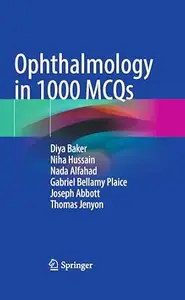

---

**Time:** 16:31:08 (Asia/Tehran)  
**Blog:** hill0  

**Title:** Sustainable Uses of Aromatic Plants in Nanotechnology  

**Details:** English | 2026 | ISBN: 9819574080 | 533 Pages | PDF EPUB (True) | 53 MB  

**Link:** http://zavat.pw/ebooks/9819574080.html  

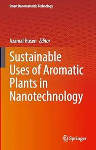

---

**Time:** 16:31:08 (Asia/Tehran)  
**Blog:** hill0  

**Title:** Practical Trends in Anesthesia and Intensive Care 2026  

**Details:** English | 2026 | ISBN: 3032257204 | 567 Pages | PDF EPUB (True) | 41 MB  

**Link:** http://zavat.pw/ebooks/3032257204.html  

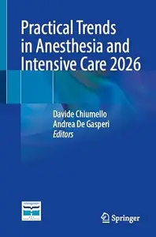

---

**Time:** 16:31:08 (Asia/Tehran)  
**Blog:** hill0  

**Title:** Complex, Intelligent and Software Intensive Systems: Volume 1  

**Details:** English | 2026 | ISBN: 3032294290 | 352 Pages | PDF EPUB (True) | 55 MB  

**Link:** http://zavat.pw/ebooks/3032294290.html  

---

**Time:** 16:31:08 (Asia/Tehran)  
**Blog:** hill0  

**Title:** Nanostructured Biomaterials and Their Applications  

**Details:** English | 2026 | ISBN: 3032163153 | 549 Pages | PDF EPUB (True) | 115 MB  

**Link:** http://zavat.pw/ebooks/3032163153.html  

---

**Time:** 16:31:08 (Asia/Tehran)  
**Blog:** hill0  

**Title:** Quantitative Methods for Finance with Simulations I  

**Details:** English | 2026 | ISBN: 3032123267 | 645 Pages | PDF EPUB (True) | 77 MB  

**Link:** http://zavat.pw/ebooks/3032123267.html  

---

**Time:** 16:31:08 (Asia/Tehran)  
**Blog:** hill0  

**Title:** The Era of Airline Revenue Management with Offers and Orders  

**Details:** English | 2026 | ISBN: 3032241960 | 825 Pages | PDF EPUB (True) | 53 MB  

**Link:** http://zavat.pw/ebooks/3032241960.html  

---

**Time:** 16:31:08 (Asia/Tehran)  
**Blog:** hill0  

**Title:** Oxygen: Evidence-Based Strategies for Delivery in Respiratory Failur  

**Details:** English | 2026 | ISBN: 3032189330 | 478 Pages | PDF EPUB (True) | 59 MB  

**Link:** http://zavat.pw/ebooks/3032189330.html  

---

**Time:** 16:31:08 (Asia/Tehran)  
**Blog:** hill0  

**Title:** The Wiley-Blackwell Handbook of Transpersonal Psychology (2nd Edition)  

**Details:** English | 2026 | ISBN: 1394215657 | 1708 Pages | EPUB (True) | 2 MB  

**Link:** http://zavat.pw/ebooks/1394215657.html  

---

**Time:** 12:38:32 (Asia/Tehran)  
**Blog:** hill0  

**Title:** Future in Composite Materials: Sustainable, High-Performance, Digitally-Driven Applications  

**Details:** English | 2026 | ISBN: 3032281474 | 321 Pages | PDF (True) | 31 MB  

**Link:** http://zavat.pw/ebooks/3032281474.html  

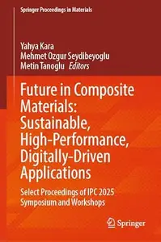

---

**Time:** 12:38:32 (Asia/Tehran)  
**Blog:** hill0  

**Title:** BRICS Plus: An Emerging New World Order?  

**Details:** English | 2026 | ISBN: 3032223474 | 411 Pages | PDF EPUB (True) | 12 MB  

**Link:** http://zavat.pw/ebooks/3032223474.html  

---

**Time:** 12:38:32 (Asia/Tehran)  
**Blog:** hill0  

**Title:** Advancing Neuropsychology Through Population Health  

**Details:** English | 2026 | ISBN: 303222456X | 226 Pages | PDF (True) | 8 MB  

**Link:** http://zavat.pw/ebooks/303222456X.html  

---

**Time:** 12:38:32 (Asia/Tehran)  
**Blog:** hill0  

**Title:** Science in the Making: Explanation in the Social Sciences  

**Details:** English | 2026 | ISBN: 3032227542 | 114 Pages | PDF EPUB (True) | XXX MB  

**Link:** http://zavat.pw/ebooks/3032227542.html  

---

**Time:** 12:38:32 (Asia/Tehran)  
**Blog:** hill0  

**Title:** Smart Sustainable Materials Advancing Remanufacturing and Technology  

**Details:** English | 2026 | ISBN: 303226149X | 629 Pages | PDF (True) | 26 MB  

**Link:** http://zavat.pw/ebooks/303226149X.html  

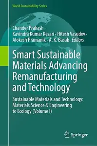

---

**Time:** 12:38:32 (Asia/Tehran)  
**Blog:** hill0  

**Title:** Parametric Modeling with Autodesk Fusion: Spring 2026 Edition  

**Details:** English | 2026 | ISBN: 1630578304 | 440 Pages | PDF | 137 MB  

**Link:** http://zavat.pw/ebooks/1630578304.html  

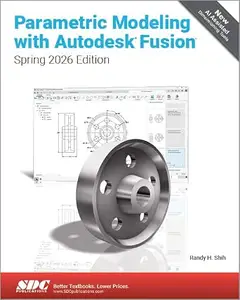

---

**Time:** 12:38:32 (Asia/Tehran)  
**Blog:** hill0  

**Title:** Geostrategic Gulf  

**Details:** English | 2026 | ISBN: 9819210690 | 168 Pages | PDF EPUB (True) | 5 MB  

**Link:** http://zavat.pw/ebooks/9819210690.html  

---

**Time:** 12:38:32 (Asia/Tehran)  
**Blog:** hill0  

**Title:** AI Agents - The Definitive Guide  

**Details:** English | 2026 | ASIN: B0GTYKTZHG | 453 Pages | MOBI AZW3 | 6 MB  

**Link:** http://zavat.pw/ebooks/B0GTYKTZHGza.html  

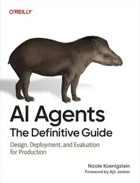

---

**Time:** 12:38:32 (Asia/Tehran)  
**Blog:** hill0  

**Title:** Sustainable Development in Water Scarcity Areas of Semi-arid Region  

**Details:** English | 2026 | ISBN: 9819596173 | 268 Pages | PDF (True) | 21 MB  

**Link:** http://zavat.pw/ebooks/9819596173.html  

---

**Time:** 12:38:32 (Asia/Tehran)  
**Blog:** hill0  

**Title:** Math Fundamentals for Audio  

**Details:** English | 2020 | ISBN: 0895798379 | 160 Pages | PDF | 44 MB  

**Link:** http://zavat.pw/ebooks/0895798379.html  

---

**Time:** 12:38:32 (Asia/Tehran)  
**Blog:** hill0  

**Title:** 5 Facts a Day Science: A Little Bit of Learning Every Day  

**Details:** English | 2026 | ISBN: 0593964527 | 274 Pages | PDF (True) | 103 MB  

**Link:** http://zavat.pw/ebooks/0593964527.html  

---

**Time:** 12:38:32 (Asia/Tehran)  
**Blog:** hill0  

**Title:** Metaphysical Revolutions in the Ancient Andes  

**Details:** English | 2026 | ISBN: 1009655086 | 363 Pages | PDF | 14 MB  

**Link:** http://zavat.pw/ebooks/1009655086.html  

---

**Time:** 12:38:32 (Asia/Tehran)  
**Blog:** hill0  

**Title:** Einführung in die Sensorik: Grundlagen  

**Details:** Deutsch | 2026 | ISBN: 3662734516 | 73 Pages | PDF (True) | 4 MB  

**Link:** http://zavat.pw/ebooks/3662734516.html  

---

**Time:** 12:38:32 (Asia/Tehran)  
**Blog:** hill0  

**Title:** Einführung in die Kombinatorik, 4.Auflage  

**Details:** Deutsch | 2026 | ISBN: 3662736055 | 375 Pages | PDF (True) | 4 MB  

**Link:** http://zavat.pw/ebooks/3662736055.html  

---

**Time:** 12:38:32 (Asia/Tehran)  
**Blog:** hill0  

**Title:** Computer Vision Toolbox User’s Guide  

**Details:** English | 2026 | ISBN: n/a | 2496 Pages | PDF True | 94 MB  

**Link:** http://zavat.pw/ebooks/Computer-Vision-Toolbox-User26.html  

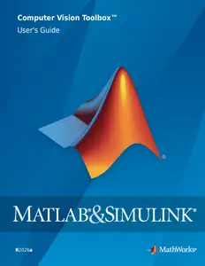

---

**Time:** 12:38:32 (Asia/Tehran)  
**Blog:** crazy-slim  

**Title:** iPhone Tipps und Tricks - September 2026  

**Details:** Deutsch | 145 pages | True PDF | 70.8 MB  

**Link:** http://zavat.pw/magazines/iPhoneTippsundTricksSeptember2026-58031.html  

---

**Time:** 12:38:32 (Asia/Tehran)  
**Blog:** crazy-slim  

**Title:** Retro Gamer Presents - Ultimate Flashback To The 80s - 3rd Edition - July 2026  

**Details:** English | 132 pages | True PDF | 117.4 MB  

**Link:** http://zavat.pw/magazines/RetroGamerPresentsUltimateFlashbackToThe80s3rdEditionJuly2026-08447.html  

---

**Time:** 12:38:32 (Asia/Tehran)  
**Blog:** crazy-slim  

**Title:** VGN Regional - 6 September 2026  

**Details:** Deutsch | 60 pages | PDF | 45.3 MB  

**Link:** http://zavat.pw/magazines/VGNRegional6September2026-51186.html  

---

**Time:** 12:38:32 (Asia/Tehran)  
**Blog:** crazy-slim  

**Title:** Natur&Land - 6 September 2026  

**Details:** Deutsch | 44 pages | PDF | 42.4 MB  

**Link:** http://zavat.pw/magazines/NaturLand6September2026-25742.html  

---

**Time:** 12:38:32 (Asia/Tehran)  
**Blog:** crazy-slim  

**Title:** Profil - 5 September 2026  

**Details:** Deutsch | 84 pages | True PDF | 36.4 MB  

**Link:** http://zavat.pw/magazines/Profil5September2026-94945.html  

---

**Time:** 12:38:32 (Asia/Tehran)  
**Blog:** crazy-slim  

**Title:** Sudoku-Rätselmeister - 6 September 2026  

**Details:** Deutsch | 108 pages | PDF | 28.7 MB  

**Link:** http://zavat.pw/magazines/SudokuR%C3%A4tselmeister6September2026-32916.html  

---

**Time:** 12:38:32 (Asia/Tehran)  
**Blog:** crazy-slim  

**Title:** Familie&Co - 6 September 2026  

**Details:** Deutsch | 48 pages | True PDF | 28.1 MB  

**Link:** http://zavat.pw/magazines/FamilieCo6September2026-69058.html  

---

**Time:** 12:38:32 (Asia/Tehran)  
**Blog:** crazy-slim  

**Title:** The Observer Magazine - 6 September 2026  

**Details:** English | 48 pages | True PDF | 41.3 MB  

**Link:** http://zavat.pw/magazines/TheObserverMagazine6September2026-73092.html  

---

**Time:** 12:38:32 (Asia/Tehran)  
**Blog:** crazy-slim  

**Title:** Historia Special Nederland - 6 September 2026  

**Details:** Nederlands | 124 pages | PDF | 118.8 MB  

**Link:** http://zavat.pw/magazines/HistoriaSpecialNederland6September2026-95804.html  

---

**Time:** 12:38:32 (Asia/Tehran)  
**Blog:** crazy-slim  

**Title:** Midi Ouest - 6 Septembre 2026  

**Details:** Français | 36 pages | PDF | 34.7 MB  

**Link:** http://zavat.pw/magazines/MidiOuest6Septembre2026-47998.html  

---

**Time:** 12:38:32 (Asia/Tehran)  
**Blog:** crazy-slim  

**Title:** The Observer The New Review - 6 September 2026  

**Details:** English | 48 pages | True PDF | 33.6 MB  

**Link:** http://zavat.pw/magazines/TheObserverTheNewReview6September2026-66166.html  

---

**Time:** 12:38:32 (Asia/Tehran)  
**Blog:** crazy-slim  

**Title:** Samsung Galaxy For Beginners - Summer 2026  

**Details:** English | 95 pages | PDF | 55.1 MB  

**Link:** http://zavat.pw/magazines/SamsungGalaxyForBeginnersSummer2026-55146.html  

---

**Time:** 12:38:32 (Asia/Tehran)  
**Blog:** crazy-slim  

**Title:** JFK Magazine - 5 September 2026  

**Details:** Nederlands | 132 pages | PDF | 82.2 MB  

**Link:** http://zavat.pw/magazines/JFKMagazine5September2026-84017.html  

---

**Time:** 12:38:32 (Asia/Tehran)  
**Blog:** crazy-slim  

**Title:** The Observer - 6 September 2026  

**Details:** English | 168 pages | True PDF | 127.8 MB  

**Link:** http://zavat.pw/newspapers/TheObserver6September2026-17546.html  

---

**Time:** 12:38:32 (Asia/Tehran)  
**Blog:** crazy-slim  

**Title:** The Independent - 6 September 2026  

**Details:** English | 157 pages | True PDF | 64.9 MB  

**Link:** http://zavat.pw/newspapers/TheIndependent6September2026-33295.html  

---

**Time:** 08:27:05 (Asia/Tehran)  
**Blog:** AvaxGenius  

**Title:** Molecular Beams in Physics and Chemistry: From Otto Stern's Pioneering Exploits to Present-Day Feats (Repost)  

**Details:** English | EPUB (True) | 2021 | 639 Pages | ISBN : 3030639622 | 140.5 MB  

**Link:** http://zavat.pw/ebooks/303606396222.html  

---

**Time:** 08:27:05 (Asia/Tehran)  
**Blog:** AvaxGenius  

**Title:** An Introduction to Nuclear Physics  

**Details:** English | PDF(True) | 2001 | 289 Pages | ISBN : 0521651492 | 1.3 MB  

**Link:** http://zavat.pw/ebooks/0521651492X.html  

---

**Time:** 08:27:05 (Asia/Tehran)  
**Blog:** crazy-slim  

**Title:** Daily Mirror Notebook - 6 September 2026  

**Details:** English | 64 pages | True PDF | 13.1 MB  

**Link:** http://zavat.pw/magazines/DailyMirrorNotebook6September2026-21698.html  

---

**Time:** 08:27:05 (Asia/Tehran)  
**Blog:** crazy-slim  

**Title:** Corriere della Sera La Lettura - 6 Settembre 2026  

**Details:** Italiano | 48 pages | True PDF | 9.8 MB  

**Link:** http://zavat.pw/magazines/CorrieredellaSeraLaLettura6Settembre2026-99796.html  

---

**Time:** 08:27:05 (Asia/Tehran)  
**Blog:** crazy-slim  

**Title:** Sunday Express Sunday Magazine - 6 September 2026  

**Details:** English | 64 pages | True PDF | 14.5 MB  

**Link:** http://zavat.pw/magazines/SundayExpressSundayMagazine6September2026-80868.html  

---

**Time:** 08:27:05 (Asia/Tehran)  
**Blog:** crazy-slim  

**Title:** NZZ am Sonntag Magazin - 6 September 2026  

**Details:** Deutsch | 32 pages | True PDF | 2.5 MB  

**Link:** http://zavat.pw/magazines/NZZamSonntagMagazin6September2026-58672.html  

---

**Time:** 08:27:05 (Asia/Tehran)  
**Blog:** crazy-slim  

**Title:** Sport España - 6 Septiembre 2026  

**Details:** Español | 32 pages | PDF | 57.9 MB  

**Link:** http://zavat.pw/newspapers/SportEspa%C3%B1a6Septiembre2026-78132.html  

---

**Time:** 08:27:05 (Asia/Tehran)  
**Blog:** crazy-slim  

**Title:** El Periódico Castellano - 6 Septiembre 2026  

**Details:** Español | 56 pages | PDF | 101.1 MB  

**Link:** http://zavat.pw/newspapers/ElPeri%C3%B3dicoCastellano6Septiembre2026-40999.html  

---

**Time:** 08:27:05 (Asia/Tehran)  
**Blog:** crazy-slim  

**Title:** Mundo Deportivo - 6 Septiembre 2026  

**Details:** Español | 48 pages | PDF | 99.0 MB  

**Link:** http://zavat.pw/newspapers/MundoDeportivo6Septiembre2026-22590.html  

---

**Time:** 08:27:05 (Asia/Tehran)  
**Blog:** crazy-slim  

**Title:** AS - 6 Septiembre 2026  

**Details:** Español | 40 pages | PDF | 78.0 MB  

**Link:** http://zavat.pw/newspapers/AS6Septiembre2026-54965.html  

---

**Time:** 08:27:05 (Asia/Tehran)  
**Blog:** crazy-slim  

**Title:** El Día - 6 Septiembre 2026  

**Details:** Español | 80 pages | PDF | 139.9 MB  

**Link:** http://zavat.pw/newspapers/ElD%C3%ADa6Septiembre2026-98076.html  

---

**Time:** 08:27:05 (Asia/Tehran)  
**Blog:** crazy-slim  

**Title:** ABC - 6 Septiembre 2026  

**Details:** Español | 64 pages | PDF | 106.7 MB  

**Link:** http://zavat.pw/newspapers/ABC6Septiembre2026-60684.html  

---

**Time:** 08:27:05 (Asia/Tehran)  
**Blog:** crazy-slim  

**Title:** Euronews English Edition - 6 September 2026  

**Details:** English | 67 pages | PDF | 176.9 MB  

**Link:** http://zavat.pw/newspapers/EuronewsEnglishEdition6September2026-18732.html  

---

**Time:** 08:27:05 (Asia/Tehran)  
**Blog:** crazy-slim  

**Title:** The Jerusalem Post - 6 September 2026  

**Details:** English | 16 pages | PDF | 53.9 MB  

**Link:** http://zavat.pw/newspapers/TheJerusalemPost6September2026-64873.html  

---

**Time:** 08:27:05 (Asia/Tehran)  
**Blog:** crazy-slim  

**Title:** Corriere del Mezzogiorno Puglia - 6 Settembre 2026  

**Details:** Italiano | 8 pages | True PDF | 1.4 MB  

**Link:** http://zavat.pw/newspapers/CorrieredelMezzogiornoPuglia6Settembre2026-78730.html  

---

**Time:** 08:27:05 (Asia/Tehran)  
**Blog:** crazy-slim  

**Title:** The Mail on Sunday - 6 September 2026  

**Details:** English | 112 pages | True PDF | 55.0 MB  

**Link:** http://zavat.pw/newspapers/TheMailonSunday6September2026-43114.html  

---

**Time:** 08:27:05 (Asia/Tehran)  
**Blog:** crazy-slim  

**Title:** The Sunday Telegraph - 6 September 2026  

**Details:** English | 32 pages | True PDF | 20.7 MB  

**Link:** http://zavat.pw/newspapers/TheSundayTelegraph6September2026-73286.html  

---

**Time:** 00:22:19 (Asia/Tehran)  
**Blog:** AvaxGenius  

**Title:** IUTAM Laminar-Turbulent Transition (Repost)  

**Details:** English | EPUB| 2022 | 809 Pages | ISBN : 3030679012 | 169.3 MB  

**Link:** http://zavat.pw/ebooks/303406793012.html  

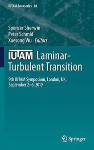

---

**Time:** 00:22:19 (Asia/Tehran)  
**Blog:** AvaxGenius  

**Title:** Proceedings of the International Conference on Big Data, IoT, and Machine Learning: BIM 2021 (Repost)  

**Details:** English | EPUB | 2022 | 784 Pages | ISBN : 9811666350 | 106.3 MB  

**Link:** http://zavat.pw/ebooks/981116663450.html  

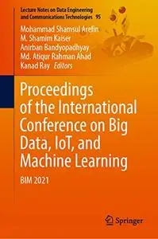

---

**Time:** 00:22:19 (Asia/Tehran)  
**Blog:** AvaxGenius  

**Title:** Advanced Manufacturing Processes II (Repost)  

**Details:** English | PDF | 2021 | 868 Pages | ISBN : 3030680134 | 117.2 MB  

**Link:** http://zavat.pw/ebooks/303068430134.html  

---

**Time:** 00:22:19 (Asia/Tehran)  
**Blog:** AvaxGenius  

**Title:** The Plaston Concept: Plastic Deformation in Structural Materials (Repost)  

**Details:** English | PDF,EPUB | 2022 | 278 Pages | ISBN : 981167714X | 106.8 MB  

**Link:** http://zavat.pw/ebooks/39811647714X.html  

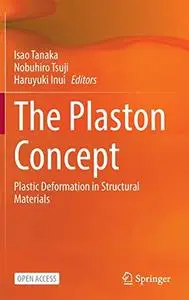

---

**Time:** 00:22:19 (Asia/Tehran)  
**Blog:** AvaxGenius  

**Title:** Microgrid Architectures, Control and Protection Methods (Repost)  

**Details:** English | EPUB | 2020 | 795 Pages | ISBN : 3030237222 | 114.95 MB  

**Link:** http://zavat.pw/ebooks/303302372222.html  

---

**Time:** 00:22:19 (Asia/Tehran)  
**Blog:** AvaxGenius  

**Title:** Soft Computing and Signal Processing: Proceedings of 4th ICSCSP 2021 (Repost)  

**Details:** English | EPUB | 2022 | 793 Pages | ISBN : 9811670870 | 132.8 MB  

**Link:** http://zavat.pw/ebooks/981146708730.html  

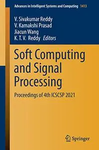

---

**Time:** 00:22:19 (Asia/Tehran)  
**Blog:** AvaxGenius  

**Title:** Proceedings of the 7th International Symposium of Space Optical Instruments and Applications (Repost)  

**Details:** English | PDF (True) | 2023 | 745 Pages | ISBN : 9819940974 | 114.9 MB  

**Link:** http://zavat.pw/ebooks/983194940974.html  

---

**Time:** 00:22:19 (Asia/Tehran)  
**Blog:** AvaxGenius  

**Title:** Multi-Hazard Early Warning and Disaster Risks (Repost)  

**Details:** English | EPUB | 2021 | 914 Pages | ISBN : 3030730026 | 137.7 MB  

**Link:** http://zavat.pw/ebooks/303074330026.html  

---

**Time:** 00:22:19 (Asia/Tehran)  
**Blog:** AvaxGenius  

**Title:** Cultural Heritage Education in the Everyday Landscape: School, Citizenship, Space, and Representation (Repost)  

**Details:** English | EPUB (True) | 2022 | 287 Pages | ISBN : 3031103947 | 106.6 MB  

**Link:** http://zavat.pw/ebooks/303311039447.html  

---

**Time:** 00:22:19 (Asia/Tehran)  
**Blog:** AvaxGenius  

**Title:** Pick Up and Oocyte Management (Repost)  

**Details:** English | EPUB | 2020 | 369 Pages | ISBN : 3030287408 | 254.2 MB  

**Link:** http://zavat.pw/ebooks/303032487408.html  

---

**Time:** 00:22:19 (Asia/Tehran)  
**Blog:** AvaxGenius  

**Title:** Handbook of Vascular Biometrics (Repost)  

**Details:** English | EPUB | 2020 | 533 Pages | ISBN : 3030277305 | 103.3 MB  

**Link:** http://zavat.pw/ebooks/303302773505.html  

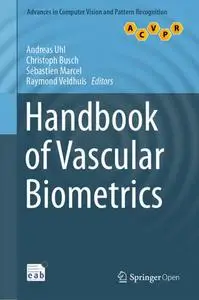

---

**Time:** 00:22:19 (Asia/Tehran)  
**Blog:** AvaxGenius  

**Title:** Machine Learning and Knowledge Discovery in Databases (Repost)  

**Details:** English | EPUB | 2021 | 770 Pages | ISBN : 3030676609 | 96.5 MB  

**Link:** http://zavat.pw/ebooks/303036764609.html  

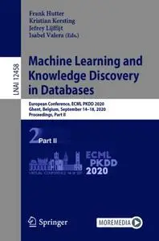

---

**Time:** 00:22:19 (Asia/Tehran)  
**Blog:** AvaxGenius  

**Title:** Computer Graphics for Artists II: Environments and Characters (Repost)  

**Details:** English | PDF | 2009 | 353 Pages | ISBN : 1848824696 | 218.76 MB  

**Link:** http://zavat.pw/ebooks/184588246596.html  

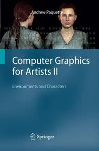

---

**Time:** 00:22:19 (Asia/Tehran)  
**Blog:** AvaxGenius  

**Title:** Assets, Beliefs, and Equilibria in Economic Dynamics: Essays in Honor of Mordecai Kurz (Repost)  

**Details:** English | PDF | 2004 | 733 Pages | ISBN : 3540009116 | 108.4 MB  

**Link:** http://zavat.pw/ebooks/354500039116.html  

---

**Time:** 00:22:19 (Asia/Tehran)  
**Blog:** AvaxGenius  

**Title:** Automation 2018 (Repost)  

**Details:** English | PDF | 2018 | 803 Pages | ISBN : 3319771787 | 142.35 MB  

**Link:** http://zavat.pw/ebooks/331977154787.html  

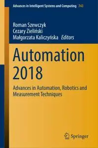

---

**Time:** 00:22:19 (Asia/Tehran)  
**Blog:** hill0  

**Title:** A Companion to Peripheral Nervous System Examination  

**Details:** English | 2025 | ISBN: 3031636279 | 239 Pages | EPUB (True) | 134 MB  

**Link:** http://zavat.pw/ebooks/3031636279E.html  

---

**Time:** 00:22:19 (Asia/Tehran)  
**Blog:** hill0  

**Title:** Atlas of Common and Rare Genodermatoses  

**Details:** English | 2024 | ISBN: 3031607872 | 270 Pages | EPUB (True) | 451 MB  

**Link:** http://zavat.pw/ebooks/3031607872e.html  

---

**Time:** 00:22:19 (Asia/Tehran)  
**Blog:** hill0  

**Title:** Forensic Pathology  

**Details:** English | 2024 | ISBN: 3031420373 | 785 Pages | EPUB (True) | 159 MB  

**Link:** http://zavat.pw/ebooks/3031420373e.html  

---

**Time:** 00:22:19 (Asia/Tehran)  
**Blog:** hill0  

**Title:** The Digital Society  

**Details:** English | 2026 | ISBN: 3658491175 | 313 Pages | PDF (True) | 5 MB  

**Link:** http://zavat.pw/ebooks/3658491175.html  

---

**Time:** 00:22:19 (Asia/Tehran)  
**Blog:** hill0  

**Title:** Resilient Statehood  

**Details:** English | 2026 | ISBN: 9819202205 | 174 Pages | PDF (True) | 5 MB  

**Link:** http://zavat.pw/ebooks/9819202205.html  

---

**Time:** 00:22:19 (Asia/Tehran)  
**Blog:** hill0  

**Title:** Minimal Surfaces and Topology of Martensitic Phase Transformations  

**Details:** English | 2026 | ISBN: 303219573X | 235 Pages | PDF (True) | 22 MB  

**Link:** http://zavat.pw/ebooks/303219573X.html  

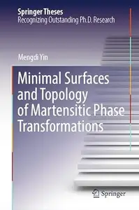

