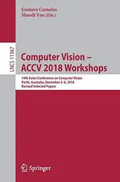
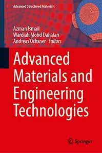
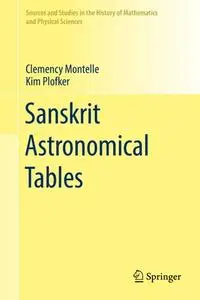
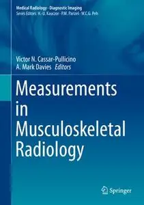
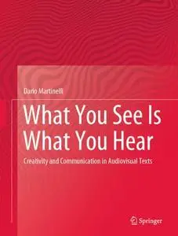
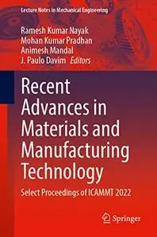
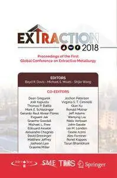
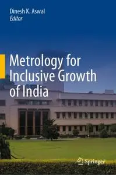

# Zavat feed - 2026-09-07

---

**Time:** 04:06:52 (Asia/Tehran)  
**Blog:** AvaxGenius  

**Title:** Freezing of Lakes and the Evolution of Their Ice Cover, Second Edition (Repost)  

**Details:** English | EPUB (True) | 2023 | 365 Pages | ISBN : 3031256042 | 109.9 MB  

**Link:** http://zavat.pw/ebooks/303512556042.html  

---

**Time:** 04:06:52 (Asia/Tehran)  
**Blog:** AvaxGenius  

**Title:** Computer Vision – ACCV 2018 Workshops (Repost)  

**Details:** English | EPUB | 2019 | 541 Pages | ISBN : 3030210731 | 152.5 MB  

**Link:** http://zavat.pw/ebooks/303021307341.html  

---

**Time:** 04:06:52 (Asia/Tehran)  
**Blog:** AvaxGenius  

**Title:** Advanced Materials and Engineering Technologies (Repost)  

**Details:** English | EPUB | 2022 | 375 Pages | ISBN : 3030929639 | 97.8 MB  

**Link:** http://zavat.pw/ebooks/303094329639.html  

---

**Time:** 04:06:52 (Asia/Tehran)  
**Blog:** AvaxGenius  

**Title:** Proceedings of the 6th International Conference on Electrical Engineering and Information Technologies for Rail Transportation  

**Details:** English | EPUB (True) | 2024 | 692 Pages | ISBN : 9819993067 | 126.7 MB  

**Link:** http://zavat.pw/ebooks/981994393067.html  

---

**Time:** 04:06:52 (Asia/Tehran)  
**Blog:** AvaxGenius  

**Title:** Evolution of Silicon Sensor Technology in Particle Physics: Basics and Applications, Third Edition (Repost)  

**Details:** English | EPUB (True) | 2024 | 477 Pages | ISBN : 3031597192 | 228.6 MB  

**Link:** http://zavat.pw/ebooks/303143597192.html  

---

**Time:** 04:06:52 (Asia/Tehran)  
**Blog:** AvaxGenius  

**Title:** Sanskrit Astronomical Tables (Repost)  

**Details:** English | EPUB | 2019 | 311 Pages | ISBN : 3319970364 | 155.75 MB  

**Link:** http://zavat.pw/ebooks/331349970364.html  

---

**Time:** 04:06:52 (Asia/Tehran)  
**Blog:** AvaxGenius  

**Title:** Measurements in Musculoskeletal Radiology (Repost)  

**Details:** English | EPUB | 2020 | 861 Pages | ISBN : 354043853X | 150.22 MB  

**Link:** http://zavat.pw/ebooks/35404338453X.html  

---

**Time:** 04:06:52 (Asia/Tehran)  
**Blog:** AvaxGenius  

**Title:** Contemporary Ideas on Ship Stability: Risk of Capsizing (Repost)  

**Details:** English | EPUB | 2019 | 931 Pages | ISBN : 3030005143 | 118.4 MB  

**Link:** http://zavat.pw/ebooks/340300051443.html  

---

**Time:** 04:06:52 (Asia/Tehran)  
**Blog:** AvaxGenius  

**Title:** What You See Is What You Hear: Creativity and Communication in Audiovisual Texts (Repost)  

**Details:** English | EPUB | 2020 | 293 Pages | ISBN : 3030325938 | 152.7 MB  

**Link:** http://zavat.pw/ebooks/303043325938.html  

---

**Time:** 04:06:52 (Asia/Tehran)  
**Blog:** AvaxGenius  

**Title:** Recent Advances in Materials and Manufacturing Technology: Select Proceedings of ICAMMT 2022 (Repost)  

**Details:** English | EPUB (True) | 2023 | 995 Pages | ISBN : 9819929202 | 158.6 8MB  

**Link:** http://zavat.pw/ebooks/598199292022.html  

---

**Time:** 04:06:52 (Asia/Tehran)  
**Blog:** AvaxGenius  

**Title:** Topics in Modal Analysis & Testing, Volume 8 (Repost)  

**Details:** English | EPUB | 2020 | 376 Pages | ISBN : 3030126838 | 187.29 MB  

**Link:** http://zavat.pw/ebooks/303301268348.html  

---

**Time:** 04:06:52 (Asia/Tehran)  
**Blog:** AvaxGenius  

**Title:** Precipitation Partitioning by Vegetation: A Global Synthesis (Repost)  

**Details:** English | EPUB | 2020 | 295 Pages | ISBN : 3030297012 | 163.31 MB  

**Link:** http://zavat.pw/ebooks/303032497012.html  

---

**Time:** 04:06:52 (Asia/Tehran)  
**Blog:** AvaxGenius  

**Title:** Integrated Computer Technologies in Mechanical Engineering - 2022: Synergetic Engineering (Repost)  

**Details:** English | EPUB (True) | 2023 | 778 Pages | ISBN : 3031362004 | 118.4 MB  

**Link:** http://zavat.pw/ebooks/30313462004.html  

---

**Time:** 04:06:52 (Asia/Tehran)  
**Blog:** AvaxGenius  

**Title:** Extraction 2018: Proceedings of the First Global Conference on Extractive Metallurgy (Repost)  

**Details:** English | PDF,EPUB | 2018 | 2862 Pages | ISBN : 3319950215 | 160.67 MB  

**Link:** http://zavat.pw/ebooks/331499530215.html  

---

**Time:** 04:06:52 (Asia/Tehran)  
**Blog:** AvaxGenius  

**Title:** Metrology for Inclusive Growth of India (Repost)  

**Details:** English | EPUB | 2020 | 1084 Pages | ISBN : 9811588716 | 243.8 MB  

**Link:** http://zavat.pw/ebooks/98511588713.html  

---

**Time:** 00:10:33 (Asia/Tehran)  
**Blog:** hill0  

**Title:** Life Underground: Tunnel into a World of Wildlife  

**Details:** English | 2023 | ISBN: 0241595770 | 35 Pages | PDF (True) | 25 MB  

**Link:** http://zavat.pw/ebooks/0241595770.html  

---

**Time:** 00:10:33 (Asia/Tehran)  
**Blog:** hill0  

**Title:** Collagen (2nd Edition)  

**Details:** English | 2026 | ISBN: 1071651935 | 283 Pages | PDF (True) | 30 MB  

**Link:** http://zavat.pw/ebooks/1071651935.html  

---

**Time:** 00:10:33 (Asia/Tehran)  
**Blog:** hill0  

**Title:** The Bedtime Book of Dinosaurs and Other Prehistoric Life  

**Details:** English | 2023 | ISBN: 0744070015 | 146 Pages | PDF (True) | 86 MB  

**Link:** http://zavat.pw/ebooks/0744070015.html  

