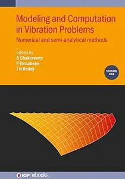
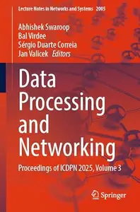
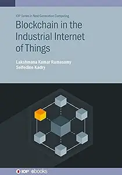

# Zavat feed - 2026-09-10

---

**Time:** 03:13:38 (Asia/Tehran)  
**Blog:** IrGens  

**Title:** A Past Without Pictures  

**Details:** English | September 8, 2026 | ISBN: 1613168055 | True EPUB | 192 pages | 3.3 MB  

**Link:** http://zavat.pw/ebooks/1613168055.html  

---

**Time:** 03:13:38 (Asia/Tehran)  
**Blog:** IrGens  

**Title:** How Can My Manager Be So Stupid?  

**Details:** English | September 1, 2026 | ISBN: 9798217182299, 9798217182312 | True EPUB | 272 pages | 5.2 MB  

**Link:** http://zavat.pw/ebooks/9798217182299.html  

---

**Time:** 01:01:59 (Asia/Tehran)  
**Blog:** IrGens  

**Title:** How Plague Got Rats: Mastering a Zoonotic Pandemic  

**Details:** English | May 19, 2026 | ISBN: 1421454726, ‎ 9781421454757 | True EPUB | 310 pages | 3.6 MB  

**Link:** http://zavat.pw/ebooks/1421454726.html  

---

**Time:** 01:01:59 (Asia/Tehran)  
**Blog:** hill0  

**Title:** MicroRNA Target Identification (2nd Edition)  

**Details:** English | 2026 | ISBN: 1071653911 | 323 Pages | PDF (True) | 35 MB  

**Link:** http://zavat.pw/ebooks/1071653911.html  

---

**Time:** 01:01:59 (Asia/Tehran)  
**Blog:** hill0  

**Title:** Modeling and Computation in Vibration Problems, Volume 1  

**Details:** English | 2021 | ISBN: 0750334819 | 467 Pages | PDF EPUB (True) | 96 MB  

**Link:** http://zavat.pw/ebooks/0750334819.html  

---

**Time:** 01:01:59 (Asia/Tehran)  
**Blog:** hill0  

**Title:** Data Processing and Networking, Volume 3  

**Details:** English | 2026 | ISBN: 303227690X | 592 Pages | PDF EPUB (True) | 78 MB  

**Link:** http://zavat.pw/ebooks/303227690X.html  

---

**Time:** 01:01:59 (Asia/Tehran)  
**Blog:** hill0  

**Title:** Blockchain in the Industrial Internet of Things  

**Details:** English | 2021 | ISBN: 0750336617 | 152 Pages | EPUB (True) | 3.3 MB  

**Link:** http://zavat.pw/ebooks/0750336617E.html  

