# Zavat feed - 2026-09-12

---

**Time:** 23:33:18 (Asia/Tehran)  
**Blog:** hill0  

**Title:** Eyewonder Dinosaurs: Open Your Eyes to a World of Discovery  

**Details:** English | 2025 | ISBN: 0593971787 | 58 Pages | PDF (True) | 30 MB  

**Link:** http://zavat.pw/ebooks/0593971787.html  

---

**Time:** 23:33:18 (Asia/Tehran)  
**Blog:** hill0  

**Title:** Advances in Heat and Mass Transfer  

**Details:** English | 2026 | ISBN: 9819594766 | 358 Pages | PDF (True) | 34 MB  

**Link:** http://zavat.pw/ebooks/9819594766.html  

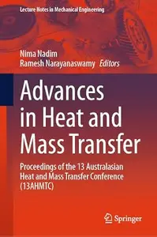

---

**Time:** 23:33:18 (Asia/Tehran)  
**Blog:** hill0  

**Title:** Firms' Strategic Decisions: Theoretical and Empirical Findings  

**Details:** English | 2018 | ISBN: 1681086263 | 298 Pages | PDF (True) | 12 MB  

**Link:** http://zavat.pw/ebooks/1681086263.html  

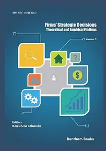

---

**Time:** 23:33:18 (Asia/Tehran)  
**Blog:** hill0  

**Title:** Photocatalytic Dye Degradation Using Green Polymeric-Based Nanostructures  

**Details:** English | 2023 | ISBN: 0750355158 | 152 Pages | PDF EPUB (True) | 22 MB  

**Link:** http://zavat.pw/ebooks/0750355158.html  

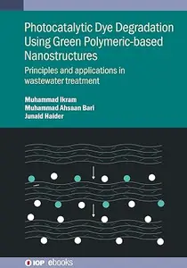

---

**Time:** 23:33:18 (Asia/Tehran)  
**Blog:** hill0  

**Title:** Human-Centered Machine Learning  

**Details:** English | 2026 | ISBN: 1108836755 | 439 Pages | PDF | 9 MB  

**Link:** http://zavat.pw/ebooks/1108836755.html  

---

**Time:** 23:33:18 (Asia/Tehran)  
**Blog:** hill0  

**Title:** Trauma-Biomechanik, 4.Auflage  

**Details:** Deutsch | 2026 | ISBN: 3662738651 | 332 Pages | PDF (True) | 20 MB  

**Link:** http://zavat.pw/ebooks/3662738651.html  

---

**Time:** 21:05:49 (Asia/Tehran)  
**Blog:** hill0  

**Title:** Sensorik: Grundlagen der Sensortechnik mit Aufgaben zur Klausurvorbereitung  

**Details:** Deutsch | 2026 | ISBN: 3662738449 | 255 Pages | PDF (True) | 16 MB  

**Link:** http://zavat.pw/ebooks/3662738449.html  

---

**Time:** 21:05:49 (Asia/Tehran)  
**Blog:** hill0  

**Title:** Data Management and Security in Blockchain Systems  

**Details:** English | 2024 | ISBN: 9815305824 | 199 Pages | PDF (True) | 33 MB  

**Link:** http://zavat.pw/ebooks/9815305824.html  

---

**Time:** 21:05:49 (Asia/Tehran)  
**Blog:** hill0  

**Title:** Hope in Hopeless Times  

**Details:** English | 2022 | ISBN: 0745347355 | 319 Pages | EPUB (True) | 0.8 MB  

**Link:** http://zavat.pw/ebooks/0745347355.html  

---

**Time:** 21:05:49 (Asia/Tehran)  
**Blog:** hill0  

**Title:** The Routledge Handbook of Smart Technologies  

**Details:** English | 2022 | ISBN: 0367369230 | 1190 Pages | EPUB (True) | 7 MB  

**Link:** http://zavat.pw/ebooks/0367369230E.html  

---

**Time:** 21:05:49 (Asia/Tehran)  
**Blog:** hill0  

**Title:** Navigating the Fintech Frontier Transformative Innovations and Risk Factors in Financial Services  

**Details:** English | 2025 | ISBN: 9815324918 | 162 Pages | PDF (True) | 9 MB  

**Link:** http://zavat.pw/ebooks/9815324918.html  

---

**Time:** 21:05:49 (Asia/Tehran)  
**Blog:** hill0  

**Title:** Money in the Metaverse  

**Details:** English | 2024 | ISBN: 1916749054 | 298 Pages | PDF (True) | 5 MB  

**Link:** http://zavat.pw/ebooks/1916749054.html  

---

**Time:** 21:05:49 (Asia/Tehran)  
**Blog:** hill0  

**Title:** Legal Responses to Space Resource Utilisation  

**Details:** English | 2026 | ISBN: 9819588634 | 354 Pages | PDF EPUB (True) | 4 MB  

**Link:** http://zavat.pw/ebooks/9819588634.html  

---

**Time:** 21:05:49 (Asia/Tehran)  
**Blog:** hill0  

**Title:** The Complete Human Body: The Definitive Visual Guide  

**Details:** English | 2023 | ISBN: 0744073677 | 535 Pages | PDF | 105 MB  

**Link:** http://zavat.pw/ebooks/0744073677.html  

---

**Time:** 21:05:49 (Asia/Tehran)  
**Blog:** crazy-slim  

**Title:** Barron's - September 14, 2026  

**Details:** English | 69 pages | True PDF | 11.3 MB  

**Link:** http://zavat.pw/magazines/BarronsSeptember142026-27826.html  

---

**Time:** 21:05:49 (Asia/Tehran)  
**Blog:** crazy-slim  

**Title:** Los Angeles Times - 12 September 2026  

**Details:** English | 169 pages | True PDF | 90.6 MB  

**Link:** http://zavat.pw/newspapers/LosAngelesTimes12September2026-45602.html  

---

**Time:** 21:05:49 (Asia/Tehran)  
**Blog:** crazy-slim  

**Title:** The Morning Call Morning Edition - 12 September 2026  

**Details:** English | 25 pages | True PDF | 16.8 MB  

**Link:** http://zavat.pw/newspapers/TheMorningCallMorningEdition12September2026-70752.html  

---

**Time:** 21:05:49 (Asia/Tehran)  
**Blog:** crazy-slim  

**Title:** Virginia Gazette - 12 September 2026  

**Details:** English | 24 pages | True PDF | 22.6 MB  

**Link:** http://zavat.pw/newspapers/VirginiaGazette12September2026-95894.html  

---

**Time:** 21:05:49 (Asia/Tehran)  
**Blog:** crazy-slim  

**Title:** USA Today - September 12, 2026  

**Details:** English | 12 pages | True PDF | 5.0 MB  

**Link:** http://zavat.pw/newspapers/USATodaySeptember122026-80581.html  

---

**Time:** 21:05:49 (Asia/Tehran)  
**Blog:** crazy-slim  

**Title:** The Globe and Mail - September 12, 2026  

**Details:** English | 78 pages | True PDF | 24.3 MB  

**Link:** http://zavat.pw/newspapers/TheGlobeandMailSeptember122026-50422.html  

---

**Time:** 21:05:49 (Asia/Tehran)  
**Blog:** crazy-slim  

**Title:** The Philadelphia Inquirer - September 12, 2026  

**Details:** English | 24 pages | True PDF | 21.6 MB  

**Link:** http://zavat.pw/newspapers/ThePhiladelphiaInquirerSeptember122026-90168.html  

---

**Time:** 21:05:49 (Asia/Tehran)  
**Blog:** crazy-slim  

**Title:** The Baltimore Sun - 12 September 2026  

**Details:** English | 28 pages | True PDF | 27.9 MB  

**Link:** http://zavat.pw/newspapers/TheBaltimoreSun12September2026-57666.html  

---

**Time:** 21:05:49 (Asia/Tehran)  
**Blog:** crazy-slim  

**Title:** The Dallas Morning News - September 12, 2026  

**Details:** English | 35 pages | True PDF | 20.7 MB  

**Link:** http://zavat.pw/newspapers/TheDallasMorningNewsSeptember122026-09392.html  

---

**Time:** 21:05:49 (Asia/Tehran)  
**Blog:** crazy-slim  

**Title:** The Baltimore Sun Carroll County Times - 12 September 2026  

**Details:** English | 24 pages | True PDF | 21.4 MB  

**Link:** http://zavat.pw/newspapers/TheBaltimoreSunCarrollCountyTimes12September2026-70549.html  

---

**Time:** 21:05:49 (Asia/Tehran)  
**Blog:** crazy-slim  

**Title:** The Boston Globe - 12 September 2026  

**Details:** English | 32 pages | True PDF | 7.3 MB  

**Link:** http://zavat.pw/newspapers/TheBostonGlobe12September2026-66679.html  

---

**Time:** 21:05:49 (Asia/Tehran)  
**Blog:** crazy-slim  

**Title:** Chicago Sun-Times - 12 September 2026  

**Details:** English | 40 pages | True PDF | 81.7 MB  

**Link:** http://zavat.pw/newspapers/ChicagoSunTimes12September2026-60155.html  

---

**Time:** 21:05:49 (Asia/Tehran)  
**Blog:** crazy-slim  

**Title:** Sun Journal - 12 September 2026  

**Details:** English | 12 pages | True PDF | 15.4 MB  

**Link:** http://zavat.pw/newspapers/SunJournal12September2026-20364.html  

---

**Time:** 21:05:49 (Asia/Tehran)  
**Blog:** crazy-slim  

**Title:** Sun Sentinel - 12 September 2026  

**Details:** English | 28 pages | True PDF | 16.9 MB  

**Link:** http://zavat.pw/newspapers/SunSentinel12September2026-48596.html  

---

**Time:** 21:05:49 (Asia/Tehran)  
**Blog:** crazy-slim  

**Title:** Orlando Sentinel - 12 September 2026  

**Details:** English | 33 pages | True PDF | 19.4 MB  

**Link:** http://zavat.pw/newspapers/OrlandoSentinel12September2026-30566.html  

---

**Time:** 18:15:31 (Asia/Tehran)  
**Blog:** hill0  

**Title:** The Cat Encyclopedia: The Definitive Visual Guide  

**Details:** English | 2024 | ISBN: 0744092000 | 322 Pages | EPUB (True) | 121 MB  

**Link:** http://zavat.pw/ebooks/0744092000e.html  

---

**Time:** 18:15:31 (Asia/Tehran)  
**Blog:** hill0  

**Title:** Dutton's Orthopaedic: Examination, Evaluation and Intervention (6th Edition)  

**Details:** English | 2023 | ISBN: 1264259077 | 1549 Pages | PDF (True) | 147 MB  

**Link:** http://zavat.pw/ebooks/1264259077.html  

---

**Time:** 18:15:31 (Asia/Tehran)  
**Blog:** hill0  

**Title:** Shoulder Arthroplasty: Principles and Practice  

**Details:** English | 2022 | ISBN: 1975157664 | 1823 Pages | EPUB (True) | 313 MB  

**Link:** http://zavat.pw/ebooks/1975157664e.html  

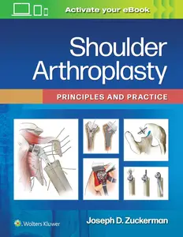

---

**Time:** 18:15:31 (Asia/Tehran)  
**Blog:** hill0  

**Title:** Bates' Guide To Physical Examination and History Taking (14th Edition)  

**Details:** English | 2026 | ISBN: 1975218345 | 2088 Pages | EPUB (True) | 164 MB  

**Link:** http://zavat.pw/ebooks/1975218345.html  

---

**Time:** 18:15:31 (Asia/Tehran)  
**Blog:** hill0  

**Title:** Dental Terminology (4th Edition)  

**Details:** English | 2022 | ISBN: 0357456823 | 450 Pages | PDF (True) | 48 MB  

**Link:** http://zavat.pw/ebooks/0357456823.html  

---

**Time:** 18:15:31 (Asia/Tehran)  
**Blog:** hill0  

**Title:** Pre-equilibrium Emission in Nuclear Reactions  

**Details:** English | 2022 | ISBN: 075035075X | 260 Pages | PDF EPUB (True) | 42 MB  

**Link:** http://zavat.pw/ebooks/075035075X.html  

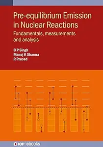

---

**Time:** 18:15:31 (Asia/Tehran)  
**Blog:** hill0  

**Title:** Physical Activity and Health in the Elderly  

**Details:** English | 2018 | ISBN: 9781608053292 | 88 Pages | PDF (True) | 3 MB  

**Link:** http://zavat.pw/ebooks/9781608053292.html  

---

**Time:** 18:15:31 (Asia/Tehran)  
**Blog:** hill0  

**Title:** Dimension-reduction Representation of Stochastic Ground Motion and Engineering Applications  

**Details:** English | 2026 | ISBN: 9819201675 | 302 Pages | PDF EPUB (True) | 45 MB  

**Link:** http://zavat.pw/ebooks/9819201675.html  

---

**Time:** 18:15:31 (Asia/Tehran)  
**Blog:** hill0  

**Title:** Virtual Nursing Education  

**Details:** English | 2026 | ISBN: 303229827X | 262 Pages | PDF EPUB (True) | 4.2 MB  

**Link:** http://zavat.pw/ebooks/303229827X.html  

---

**Time:** 18:15:31 (Asia/Tehran)  
**Blog:** hill0  

**Title:** Sex and Gender (2nd Edition)  

**Details:** English | 2026 | ISBN: 3032402174 | 367 Pages | PDF (True) | 17 MB  

**Link:** http://zavat.pw/ebooks/3032402174.html  

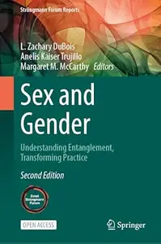

---

**Time:** 18:15:31 (Asia/Tehran)  
**Blog:** hill0  

**Title:** AI for Epidemic Preparedness  

**Details:** English | 2026 | ISBN: 3032306469 | 538 Pages | PDF EPUB (True) | 39 MB  

**Link:** http://zavat.pw/ebooks/3032306469.html  

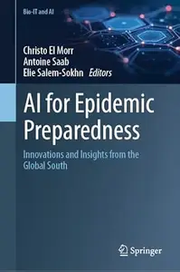

---

**Time:** 18:15:31 (Asia/Tehran)  
**Blog:** hill0  

**Title:** Surgery for Degenerative Lumbar Spine: Vol.2  

**Details:** English | 2026 | ISBN: 3032326885 | 234 Pages | PDF EPUB (True) | 70 MB  

**Link:** http://zavat.pw/ebooks/3032326885.html  

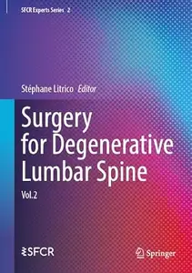

---

**Time:** 18:15:31 (Asia/Tehran)  
**Blog:** hill0  

**Title:** Reliable Evaluations for LLMs and AI Agents  

**Details:** English | 2026 | ISBN: 303226748X | 199 Pages | PDF EPUB (True) | 19 MB  

**Link:** http://zavat.pw/ebooks/303226748X.html  

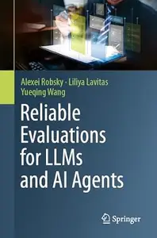

---

**Time:** 15:10:58 (Asia/Tehran)  
**Blog:** hill0  

**Title:** Frankfurter Allgemeine Magazin - September 2026  

**Details:** Deutsch | 88 pages | True PDF | 14 MB  

**Link:** http://zavat.pw/magazines/FAZMagazin-12-09-26.html  

---

**Time:** 15:10:58 (Asia/Tehran)  
**Blog:** hill0  

**Title:** Knowledge Encyclopedia!  

**Details:** English | 2023 | ISBN: 0241569974 | 362 Pages | PDF (True) | 152 MB  

**Link:** http://zavat.pw/ebooks/0241569974.html  

---

**Time:** 15:10:58 (Asia/Tehran)  
**Blog:** hill0  

**Title:** Innovations in Data Analytics, Volume 2  

**Details:** English | 2026 | ISBN: 3032278449 | 493 Pages | PDF (True) | 81 MB  

**Link:** http://zavat.pw/ebooks/3032278449.html  

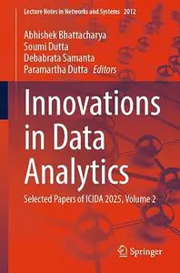

---

**Time:** 15:10:58 (Asia/Tehran)  
**Blog:** hill0  

**Title:** Advances in Data Science and Management, Volume 2  

**Details:** English | 2026 | ISBN: 3032335809 | 388 Pages | PDF (True) | 46 MB  

**Link:** http://zavat.pw/ebooks/3032335809.html  

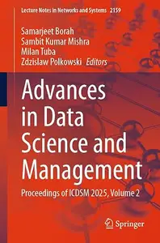

---

**Time:** 15:10:58 (Asia/Tehran)  
**Blog:** hill0  

**Title:** Geoinformatics and Data Analysis  

**Details:** English | 2026 | ISBN: 3032364442 | 229 Pages | PDF EPUB (True) | 39 MB  

**Link:** http://zavat.pw/ebooks/3032364442F.html  

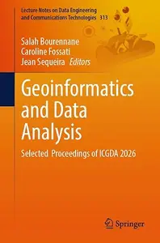

---

**Time:** 15:10:58 (Asia/Tehran)  
**Blog:** crazy-slim  

**Title:** The Washington Post - September 12, 2026  

**Details:** English | 36 pages | True PDF | 82.0 MB  

**Link:** http://zavat.pw/newspapers/TheWashingtonPostSeptember122026-33727.html  

---

**Time:** 15:10:58 (Asia/Tehran)  
**Blog:** crazy-slim  

**Title:** The Wall Street Journal - September 12, 2026  

**Details:** English | 54 pages | True PDF | 20.9 MB  

**Link:** http://zavat.pw/newspapers/TheWallStreetJournalSeptember122026-60097.html  

---

**Time:** 10:49:12 (Asia/Tehran)  
**Blog:** yoyoloit  

**Title:** In Defense of Indoctrination: The Liberal Arts and the Myth of Thinking for Yourself  

**Details:** English | 2026 | ISBN: 1666906654 | 233 pages | True PDF | 1.85 MB  

**Link:** http://zavat.pw/ebooks/1666906654.html  

---

**Time:** 10:49:12 (Asia/Tehran)  
**Blog:** hill0  

**Title:** Advances in Quantum Science I: Theoretical and Methodological Approaches  

**Details:** English | 2026 | ISBN: 9819597161 | 380 Pages | PDF EPUB (True) | 32 MB  

**Link:** http://zavat.pw/ebooks/9819597161.html  

---

**Time:** 10:49:12 (Asia/Tehran)  
**Blog:** hill0  

**Title:** Mobile Radio Communications and 5G Networks  

**Details:** English | 2026 | ISBN: 3032310962 | 549 Pages | PDF (True) | 79 MB  

**Link:** http://zavat.pw/ebooks/3032310962.html  

---

**Time:** 10:49:12 (Asia/Tehran)  
**Blog:** hill0  

**Title:** Business Intelligence and Data Analytics, Volume 1  

**Details:** English | 2026 | ISBN: 3032159954 | 516 Pages | PDF (True) | 70 MB  

**Link:** http://zavat.pw/ebooks/3032159954.html  

---

**Time:** 10:49:12 (Asia/Tehran)  
**Blog:** hill0  

**Title:** Intelligent Decision Technologies  

**Details:** English | 2026 | ISBN: 3032041856 | 166 Pages | PDF (True) | 9 MB  

**Link:** http://zavat.pw/ebooks/3032041856.html  

---

**Time:** 10:49:12 (Asia/Tehran)  
**Blog:** hill0  

**Title:** Hybrid Intelligence: Theories and Applications, Volume 1  

**Details:** English | 2026 | ISBN: 3032195209 | 377 Pages | PDF (True) | 57 MB  

**Link:** http://zavat.pw/ebooks/3032195209.html  

---

**Time:** 10:49:12 (Asia/Tehran)  
**Blog:** hill0  

**Title:** Microfoundations of Keynesian Economics  

**Details:** English | 2026 | ISBN: 9819593891 | 296 Pages | PDF EPUB (True) | 21 MB  

**Link:** http://zavat.pw/ebooks/9819593891.html  

---

**Time:** 10:49:12 (Asia/Tehran)  
**Blog:** hill0  

**Title:** Le Temps - 12 Septembre 2026  

**Details:** Français | 44 pages | True PDF | 20 MB  

**Link:** http://zavat.pw/newspapers/le-temps-20260912.html  

---

**Time:** 10:49:12 (Asia/Tehran)  
**Blog:** hill0  

**Title:** Frankfurter Allgemeine Sonntags Zeitung - 13 September 2026  

**Details:** Deutsch | 61 pages | True PDF | 20 MB  

**Link:** http://zavat.pw/newspapers/FAZ-Sonntag-13-09-26.html  

---

**Time:** 10:49:12 (Asia/Tehran)  
**Blog:** hill0  

**Title:** Frankfurter Allgemeine Zeitung - 12 September 2026  

**Details:** Deutsch | 76 pages | True PDF | 32 MB  

**Link:** http://zavat.pw/newspapers/FAZ-12-09-26.html  

---

**Time:** 10:49:12 (Asia/Tehran)  
**Blog:** hill0  

**Title:** Süddeutsche Zeitung - 12 September 2026  

**Details:** Deutsch | 60 pages | True PDF | 15 MB  

**Link:** http://zavat.pw/newspapers/SZ-120926.html  

---

**Time:** 10:49:12 (Asia/Tehran)  
**Blog:** hill0  

**Title:** General World Models: The Physics of Generative Video  

**Details:** English | 2026 | ASIN: B0H6RM9YQW | 154 Pages | PDF EPUB (True) | 25 MB  

**Link:** http://zavat.pw/ebooks/B0H6RM9YQW.html  

---

**Time:** 10:49:12 (Asia/Tehran)  
**Blog:** crazy-slim  

**Title:** California Post - September 12, 2026  

**Details:** English | 48 pages | PDF | 85.0 MB  

**Link:** http://zavat.pw/newspapers/CaliforniaPostSeptember122026-23567.html  

---

**Time:** 10:49:12 (Asia/Tehran)  
**Blog:** crazy-slim  

**Title:** National Geographic Italia - Ottobre 2025  

**Details:** Italiano | 152 pages | True PDF | 36.1 MB  

**Link:** http://zavat.pw/magazines/NationalGeographicItaliaOttobre2025-53206.html  

---

**Time:** 10:49:12 (Asia/Tehran)  
**Blog:** crazy-slim  

**Title:** National Geographic Italia - Marzo 2025  

**Details:** Italiano | 140 pages | True PDF | 38.6 MB  

**Link:** http://zavat.pw/magazines/NationalGeographicItaliaMarzo2025-19630.html  

---

**Time:** 10:49:12 (Asia/Tehran)  
**Blog:** crazy-slim  

**Title:** National Geographic Italia - Settembre 2025  

**Details:** Italiano | 148 pages | True PDF | 24.4 MB  

**Link:** http://zavat.pw/magazines/NationalGeographicItaliaSettembre2025-72647.html  

---

**Time:** 10:49:12 (Asia/Tehran)  
**Blog:** crazy-slim  

**Title:** National Geographic Italia - Maggio 2025  

**Details:** Italiano | 144 pages | True PDF | 41.8 MB  

**Link:** http://zavat.pw/magazines/NationalGeographicItaliaMaggio2025-31858.html  

---

**Time:** 10:49:12 (Asia/Tehran)  
**Blog:** crazy-slim  

**Title:** National Geographic Italia - Giugno 2025  

**Details:** Italiano | 148 pages | True PDF | 36.8 MB  

**Link:** http://zavat.pw/magazines/NationalGeographicItaliaGiugno2025-56027.html  

---

**Time:** 10:49:12 (Asia/Tehran)  
**Blog:** crazy-slim  

**Title:** National Geographic Italia - Novembre 2025  

**Details:** Italiano | 152 pages | True PDF | 18.5 MB  

**Link:** http://zavat.pw/magazines/NationalGeographicItaliaNovembre2025-60623.html  

---

**Time:** 10:49:12 (Asia/Tehran)  
**Blog:** crazy-slim  

**Title:** National Geographic Italia - Luglio 2025  

**Details:** Italiano | 148 pages | True PDF | 36.6 MB  

**Link:** http://zavat.pw/magazines/NationalGeographicItaliaLuglio2025-59227.html  

---

**Time:** 10:49:12 (Asia/Tehran)  
**Blog:** crazy-slim  

**Title:** National Geographic Italia - Gennaio 2025  

**Details:** Italiano | 128 pages | True PDF | 42.1 MB  

**Link:** http://zavat.pw/magazines/NationalGeographicItaliaGennaio2025-83614.html  

---

**Time:** 10:49:12 (Asia/Tehran)  
**Blog:** crazy-slim  

**Title:** National Geographic Italia - Aprile 2025  

**Details:** Italiano | 132 pages | True PDF | 40.2 MB  

**Link:** http://zavat.pw/magazines/NationalGeographicItaliaAprile2025-31357.html  

---

**Time:** 10:49:12 (Asia/Tehran)  
**Blog:** crazy-slim  

**Title:** National Geographic Italia - Agosto 2025  

**Details:** Italiano | 156 pages | True PDF | 42.8 MB  

**Link:** http://zavat.pw/magazines/NationalGeographicItaliaAgosto2025-89925.html  

---

**Time:** 10:49:12 (Asia/Tehran)  
**Blog:** crazy-slim  

**Title:** The Guardian USA - September 12, 2026  

**Details:** English | 77 pages | PDF | 208.8 MB  

**Link:** http://zavat.pw/newspapers/TheGuardianUSASeptember122026-76125.html  

---

**Time:** 10:49:12 (Asia/Tehran)  
**Blog:** crazy-slim  

**Title:** National Geographic Italia - Febbraio 2025  

**Details:** Italiano | 140 pages | True PDF | 38.3 MB  

**Link:** http://zavat.pw/magazines/NationalGeographicItaliaFebbraio2025-90167.html  

---

**Time:** 10:49:12 (Asia/Tehran)  
**Blog:** crazy-slim  

**Title:** National Geographic Italia - Dicembre 2025  

**Details:** Italiano | 152 pages | True PDF | 24.0 MB  

**Link:** http://zavat.pw/magazines/NationalGeographicItaliaDicembre2025-41570.html  

---

**Time:** 10:49:12 (Asia/Tehran)  
**Blog:** crazy-slim  

**Title:** Corriere dello Sport Stadio - 12 Settembre 2026  

**Details:** Italiano | 40 pages | PDF | 88.2 MB  

**Link:** http://zavat.pw/newspapers/CorrieredelloSportStadio12Settembre2026-16769.html  

---

**Time:** 03:15:15 (Asia/Tehran)  
**Blog:** AvaxGenius  

**Title:** Introductory Notes on Valuation Rings and Function Fields in One Variable (Repost)  

**Details:** English | PDF(True) | 2014 | 125 Pages | ISBN : 8876425004 | 0.88 MB  

**Link:** http://zavat.pw/ebooks/88764525004.html  

---

**Time:** 03:15:15 (Asia/Tehran)  
**Blog:** AvaxGenius  

**Title:** Geometry, Structure and Randomness in Combinatorics  

**Details:** English | PDF(True) | 2014 | 156 Pages | ISBN : 8876425241 | 1.8 MB  

**Link:** http://zavat.pw/ebooks/85876425241.html  

---

**Time:** 03:15:15 (Asia/Tehran)  
**Blog:** AvaxGenius  

**Title:** Instrumentation And Techniques In High Energy Physics  

**Details:** English | PDF(True) | 2024 | 302 Pages | ISBN : 9819801117 | 43.3 MB  

**Link:** http://zavat.pw/ebooks/9819801117.html  

---

**Time:** 03:15:15 (Asia/Tehran)  
**Blog:** AvaxGenius  

**Title:** Cosmological Models of the Universe  

**Details:** English | PDF(True) | 2026 | 270 Pages | ISBN : 3725882215 | 16.6 MB  

**Link:** http://zavat.pw/ebooks/3725882215.html  

---

**Time:** 03:15:15 (Asia/Tehran)  
**Blog:** AvaxGenius  

**Title:** Quantum Mechanics: Concepts, Symmetries, and Recent Developments  

**Details:** English | PDF(True) | 2025 | 202 Pages | ISBN : 3725832404 | 6.4 MB  

**Link:** http://zavat.pw/ebooks/3725832404.html  

---

**Time:** 03:15:15 (Asia/Tehran)  
**Blog:** AvaxGenius  

**Title:** Teaching and Learning Quantum Theory and Particle Physics  

**Details:** English | PDF(True) | 2025 | 188 Pages | ISBN : 3725856796 | 10.7 MB  

**Link:** http://zavat.pw/ebooks/3725856796.html  

---

**Time:** 01:18:41 (Asia/Tehran)  
**Blog:** hill0  

**Title:** Eco-dynamics and Environmental Perturbations in Mangrove Ecosystems  

**Details:** English | 2026 | ISBN: 3032087090 | 853 Pages | PDF (True) | 81 MB  

**Link:** http://zavat.pw/ebooks/3032087090.html  

