# Zavat feed - 2026-09-12

---

**Time:** 10:49:12 (Asia/Tehran)  
**Blog:** yoyoloit  

**Title:** In Defense of Indoctrination: The Liberal Arts and the Myth of Thinking for Yourself  

**Details:** English | 2026 | ISBN: 1666906654 | 233 pages | True PDF | 1.85 MB  

**Link:** http://zavat.pw/ebooks/1666906654.html  

---

**Time:** 10:49:12 (Asia/Tehran)  
**Blog:** hill0  

**Title:** Advances in Quantum Science I: Theoretical and Methodological Approaches  

**Details:** English | 2026 | ISBN: 9819597161 | 380 Pages | PDF EPUB (True) | 32 MB  

**Link:** http://zavat.pw/ebooks/9819597161.html  

---

**Time:** 10:49:12 (Asia/Tehran)  
**Blog:** hill0  

**Title:** Mobile Radio Communications and 5G Networks  

**Details:** English | 2026 | ISBN: 3032310962 | 549 Pages | PDF (True) | 79 MB  

**Link:** http://zavat.pw/ebooks/3032310962.html  

---

**Time:** 10:49:12 (Asia/Tehran)  
**Blog:** hill0  

**Title:** Business Intelligence and Data Analytics, Volume 1  

**Details:** English | 2026 | ISBN: 3032159954 | 516 Pages | PDF (True) | 70 MB  

**Link:** http://zavat.pw/ebooks/3032159954.html  

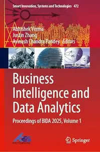

---

**Time:** 10:49:12 (Asia/Tehran)  
**Blog:** hill0  

**Title:** Intelligent Decision Technologies  

**Details:** English | 2026 | ISBN: 3032041856 | 166 Pages | PDF (True) | 9 MB  

**Link:** http://zavat.pw/ebooks/3032041856.html  

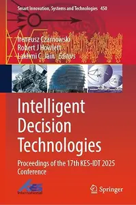

---

**Time:** 10:49:12 (Asia/Tehran)  
**Blog:** hill0  

**Title:** Hybrid Intelligence: Theories and Applications, Volume 1  

**Details:** English | 2026 | ISBN: 3032195209 | 377 Pages | PDF (True) | 57 MB  

**Link:** http://zavat.pw/ebooks/3032195209.html  

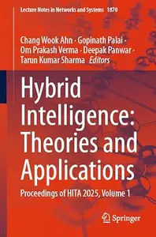

---

**Time:** 10:49:12 (Asia/Tehran)  
**Blog:** hill0  

**Title:** Microfoundations of Keynesian Economics  

**Details:** English | 2026 | ISBN: 9819593891 | 296 Pages | PDF EPUB (True) | 21 MB  

**Link:** http://zavat.pw/ebooks/9819593891.html  

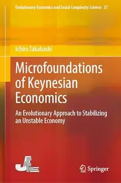

---

**Time:** 10:49:12 (Asia/Tehran)  
**Blog:** hill0  

**Title:** Le Temps - 12 Septembre 2026  

**Details:** Français | 44 pages | True PDF | 20 MB  

**Link:** http://zavat.pw/newspapers/le-temps-20260912.html  

---

**Time:** 10:49:12 (Asia/Tehran)  
**Blog:** hill0  

**Title:** Frankfurter Allgemeine Sonntags Zeitung - 13 September 2026  

**Details:** Deutsch | 61 pages | True PDF | 20 MB  

**Link:** http://zavat.pw/newspapers/FAZ-Sonntag-13-09-26.html  

---

**Time:** 10:49:12 (Asia/Tehran)  
**Blog:** hill0  

**Title:** Frankfurter Allgemeine Zeitung - 12 September 2026  

**Details:** Deutsch | 76 pages | True PDF | 32 MB  

**Link:** http://zavat.pw/newspapers/FAZ-12-09-26.html  

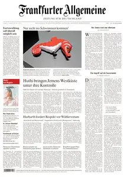

---

**Time:** 10:49:12 (Asia/Tehran)  
**Blog:** hill0  

**Title:** Süddeutsche Zeitung - 12 September 2026  

**Details:** Deutsch | 60 pages | True PDF | 15 MB  

**Link:** http://zavat.pw/newspapers/SZ-120926.html  

---

**Time:** 10:49:12 (Asia/Tehran)  
**Blog:** hill0  

**Title:** General World Models: The Physics of Generative Video  

**Details:** English | 2026 | ASIN: B0H6RM9YQW | 154 Pages | PDF EPUB (True) | 25 MB  

**Link:** http://zavat.pw/ebooks/B0H6RM9YQW.html  

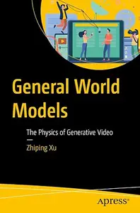

---

**Time:** 10:49:12 (Asia/Tehran)  
**Blog:** crazy-slim  

**Title:** California Post - September 12, 2026  

**Details:** English | 48 pages | PDF | 85.0 MB  

**Link:** http://zavat.pw/newspapers/CaliforniaPostSeptember122026-23567.html  

---

**Time:** 10:49:12 (Asia/Tehran)  
**Blog:** crazy-slim  

**Title:** National Geographic Italia - Ottobre 2025  

**Details:** Italiano | 152 pages | True PDF | 36.1 MB  

**Link:** http://zavat.pw/magazines/NationalGeographicItaliaOttobre2025-53206.html  

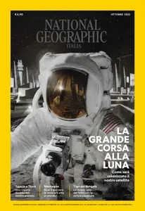

---

**Time:** 10:49:12 (Asia/Tehran)  
**Blog:** crazy-slim  

**Title:** National Geographic Italia - Marzo 2025  

**Details:** Italiano | 140 pages | True PDF | 38.6 MB  

**Link:** http://zavat.pw/magazines/NationalGeographicItaliaMarzo2025-19630.html  

---

**Time:** 10:49:12 (Asia/Tehran)  
**Blog:** crazy-slim  

**Title:** National Geographic Italia - Settembre 2025  

**Details:** Italiano | 148 pages | True PDF | 24.4 MB  

**Link:** http://zavat.pw/magazines/NationalGeographicItaliaSettembre2025-72647.html  

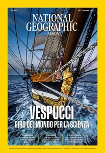

---

**Time:** 10:49:12 (Asia/Tehran)  
**Blog:** crazy-slim  

**Title:** National Geographic Italia - Maggio 2025  

**Details:** Italiano | 144 pages | True PDF | 41.8 MB  

**Link:** http://zavat.pw/magazines/NationalGeographicItaliaMaggio2025-31858.html  

---

**Time:** 10:49:12 (Asia/Tehran)  
**Blog:** crazy-slim  

**Title:** National Geographic Italia - Giugno 2025  

**Details:** Italiano | 148 pages | True PDF | 36.8 MB  

**Link:** http://zavat.pw/magazines/NationalGeographicItaliaGiugno2025-56027.html  

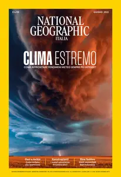

---

**Time:** 10:49:12 (Asia/Tehran)  
**Blog:** crazy-slim  

**Title:** National Geographic Italia - Novembre 2025  

**Details:** Italiano | 152 pages | True PDF | 18.5 MB  

**Link:** http://zavat.pw/magazines/NationalGeographicItaliaNovembre2025-60623.html  

---

**Time:** 10:49:12 (Asia/Tehran)  
**Blog:** crazy-slim  

**Title:** National Geographic Italia - Luglio 2025  

**Details:** Italiano | 148 pages | True PDF | 36.6 MB  

**Link:** http://zavat.pw/magazines/NationalGeographicItaliaLuglio2025-59227.html  

---

**Time:** 10:49:12 (Asia/Tehran)  
**Blog:** crazy-slim  

**Title:** National Geographic Italia - Gennaio 2025  

**Details:** Italiano | 128 pages | True PDF | 42.1 MB  

**Link:** http://zavat.pw/magazines/NationalGeographicItaliaGennaio2025-83614.html  

---

**Time:** 10:49:12 (Asia/Tehran)  
**Blog:** crazy-slim  

**Title:** National Geographic Italia - Aprile 2025  

**Details:** Italiano | 132 pages | True PDF | 40.2 MB  

**Link:** http://zavat.pw/magazines/NationalGeographicItaliaAprile2025-31357.html  

---

**Time:** 10:49:12 (Asia/Tehran)  
**Blog:** crazy-slim  

**Title:** National Geographic Italia - Agosto 2025  

**Details:** Italiano | 156 pages | True PDF | 42.8 MB  

**Link:** http://zavat.pw/magazines/NationalGeographicItaliaAgosto2025-89925.html  

---

**Time:** 10:49:12 (Asia/Tehran)  
**Blog:** crazy-slim  

**Title:** The Guardian USA - September 12, 2026  

**Details:** English | 77 pages | PDF | 208.8 MB  

**Link:** http://zavat.pw/newspapers/TheGuardianUSASeptember122026-76125.html  

---

**Time:** 10:49:12 (Asia/Tehran)  
**Blog:** crazy-slim  

**Title:** National Geographic Italia - Febbraio 2025  

**Details:** Italiano | 140 pages | True PDF | 38.3 MB  

**Link:** http://zavat.pw/magazines/NationalGeographicItaliaFebbraio2025-90167.html  

---

**Time:** 10:49:12 (Asia/Tehran)  
**Blog:** crazy-slim  

**Title:** National Geographic Italia - Dicembre 2025  

**Details:** Italiano | 152 pages | True PDF | 24.0 MB  

**Link:** http://zavat.pw/magazines/NationalGeographicItaliaDicembre2025-41570.html  

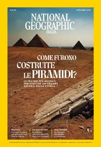

---

**Time:** 10:49:12 (Asia/Tehran)  
**Blog:** crazy-slim  

**Title:** Corriere dello Sport Stadio - 12 Settembre 2026  

**Details:** Italiano | 40 pages | PDF | 88.2 MB  

**Link:** http://zavat.pw/newspapers/CorrieredelloSportStadio12Settembre2026-16769.html  

---

**Time:** 03:15:15 (Asia/Tehran)  
**Blog:** AvaxGenius  

**Title:** Introductory Notes on Valuation Rings and Function Fields in One Variable (Repost)  

**Details:** English | PDF(True) | 2014 | 125 Pages | ISBN : 8876425004 | 0.88 MB  

**Link:** http://zavat.pw/ebooks/88764525004.html  

---

**Time:** 03:15:15 (Asia/Tehran)  
**Blog:** AvaxGenius  

**Title:** Geometry, Structure and Randomness in Combinatorics  

**Details:** English | PDF(True) | 2014 | 156 Pages | ISBN : 8876425241 | 1.8 MB  

**Link:** http://zavat.pw/ebooks/85876425241.html  

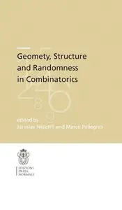

---

**Time:** 03:15:15 (Asia/Tehran)  
**Blog:** AvaxGenius  

**Title:** Instrumentation And Techniques In High Energy Physics  

**Details:** English | PDF(True) | 2024 | 302 Pages | ISBN : 9819801117 | 43.3 MB  

**Link:** http://zavat.pw/ebooks/9819801117.html  

---

**Time:** 03:15:15 (Asia/Tehran)  
**Blog:** AvaxGenius  

**Title:** Cosmological Models of the Universe  

**Details:** English | PDF(True) | 2026 | 270 Pages | ISBN : 3725882215 | 16.6 MB  

**Link:** http://zavat.pw/ebooks/3725882215.html  

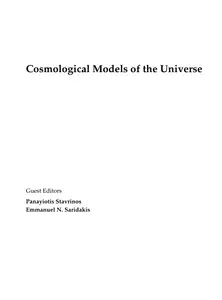

---

**Time:** 03:15:15 (Asia/Tehran)  
**Blog:** AvaxGenius  

**Title:** Quantum Mechanics: Concepts, Symmetries, and Recent Developments  

**Details:** English | PDF(True) | 2025 | 202 Pages | ISBN : 3725832404 | 6.4 MB  

**Link:** http://zavat.pw/ebooks/3725832404.html  

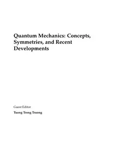

---

**Time:** 03:15:15 (Asia/Tehran)  
**Blog:** AvaxGenius  

**Title:** Teaching and Learning Quantum Theory and Particle Physics  

**Details:** English | PDF(True) | 2025 | 188 Pages | ISBN : 3725856796 | 10.7 MB  

**Link:** http://zavat.pw/ebooks/3725856796.html  

---

**Time:** 01:18:41 (Asia/Tehran)  
**Blog:** hill0  

**Title:** Eco-dynamics and Environmental Perturbations in Mangrove Ecosystems  

**Details:** English | 2026 | ISBN: 3032087090 | 853 Pages | PDF (True) | 81 MB  

**Link:** http://zavat.pw/ebooks/3032087090.html  

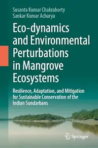

