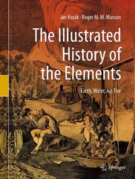
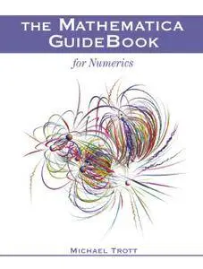
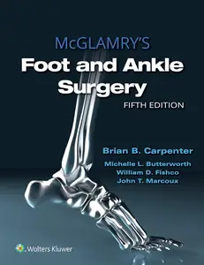

# Zavat feed - 2026-09-13

---

**Time:** 03:17:07 (Asia/Tehran)  
**Blog:** AvaxGenius  

**Title:** The Illustrated History of the Elements Earth, Water, Air, Fire  

**Details:** English | PDF(True) | 2020 | 283 Pages | ISBN : 3030214249 | 109.6 MB  

**Link:** http://zavat.pw/ebooks/3030214249XR.html  

---

**Time:** 03:17:07 (Asia/Tehran)  
**Blog:** AvaxGenius  

**Title:** The Mathematica GuideBook for Numerics (Repost)  

**Details:** English | PDF (True) | 2006 | 1243 Pages | ISBN : 0387950117 | 278.72 MB  

**Link:** http://zavat.pw/ebooks/0387954440117.html  

---

**Time:** 01:27:59 (Asia/Tehran)  
**Blog:** hill0  

**Title:** McGlamry's Foot and Ankle Surgery (5th Edition)  

**Details:** English | 2022 | ISBN: 1975136063 | 5367 Pages | EPUB (True) | 695 MB  

**Link:** http://zavat.pw/ebooks/1975136063T.html  

