# Zavat feed - 2026-09-19

---

**Time:** 20:27:37 (Asia/Tehran)  
**Blog:** AvaxGenius  

**Title:** The Austin Protocol Compiler  

**Details:** English | PDF(True) | 2005 | 146 Pages | ISBN : 0387232273 | 3.1 MB  

**Link:** http://zavat.pw/ebooks/03873232273.html  

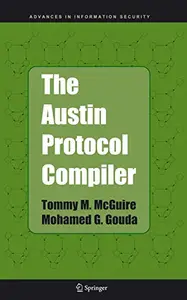

---

**Time:** 20:27:37 (Asia/Tehran)  
**Blog:** AvaxGenius  

**Title:** Understanding Intrusion Detection through Visualization  

**Details:** English | PDF | 2006 | 157 Pages | ISBN : 0387276343 | 22.1 MB  

**Link:** http://zavat.pw/ebooks/03872736343.html  

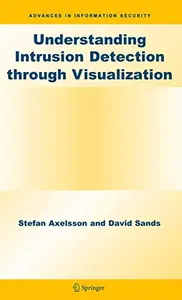

---

**Time:** 20:27:37 (Asia/Tehran)  
**Blog:** AvaxGenius  

**Title:** Intrusion Detection Systems  

**Details:** English | PDF(True) | 2008 | 265 Pages | ISBN : 0387772650 | 4.5 MB  

**Link:** http://zavat.pw/ebooks/03877472650.html  

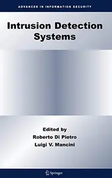

---

**Time:** 20:27:37 (Asia/Tehran)  
**Blog:** hill0  

**Title:** Die Sprache des Kapitalismus  

**Details:** Deutsch | 2024 | ISBN: 3103975937 | 302 Pages | EPUB | 4 MB  

**Link:** http://zavat.pw/ebooks/3103975937.html  

---

**Time:** 17:07:16 (Asia/Tehran)  
**Blog:** hill0  

**Title:** Artificial Intelligence, Machine Learning and User Interface Design  

**Details:** English | 2024 | ISBN: 9815179616 | 303 Pages | PDF (True) | 97 MB  

**Link:** http://zavat.pw/ebooks/9815179616t.html  

---

**Time:** 17:07:16 (Asia/Tehran)  
**Blog:** hill0  

**Title:** Japan After Dark  

**Details:** English | 2026 | ISBN: 1009624849 | 265 Pages | PDF | 15 MB  

**Link:** http://zavat.pw/ebooks/1009624849.html  

---

**Time:** 17:07:16 (Asia/Tehran)  
**Blog:** hill0  

**Title:** Electrochemical Strategies in Organic Synthesis  

**Details:** English | 2026 | ISBN: 3527355766 | 824 Pages | EPUB (True) | 30 MB  

**Link:** http://zavat.pw/ebooks/3527355766.html  

---

**Time:** 17:07:16 (Asia/Tehran)  
**Blog:** hill0  

**Title:** Islamic Banking And Finance In South-East Asia: Its Development And Future (3rd Edition)  

**Details:** English | 2012 | ISBN: 9814350427 | 264 Pages | PDF (True) | 1.4 MB  

**Link:** http://zavat.pw/ebooks/9814350427.html  

---

**Time:** 17:07:16 (Asia/Tehran)  
**Blog:** hill0  

**Title:** Engineering Societies and Undergraduate Engineering Education  

**Details:** English | 2017 | ISBN: 0309464668 | 99 Pages | EPUB (True) | 0.4 MB  

**Link:** http://zavat.pw/ebooks/0309464668.html  

---

**Time:** 17:07:16 (Asia/Tehran)  
**Blog:** hill0  

**Title:** The Precarious City  

**Details:** English | 2026 | ISBN: 3032317355 | 168 Pages | PDF (True) | 8 MB  

**Link:** http://zavat.pw/ebooks/3032317355.html  

---

**Time:** 17:07:16 (Asia/Tehran)  
**Blog:** hill0  

**Title:** The 4th EAI International Conference on Automation and Control in Theory and Practice  

**Details:** English | 2026 | ISBN: 3032333512 | 330 Pages | PDF (True) | 24 MB  

**Link:** http://zavat.pw/ebooks/3032333512.html  

---

**Time:** 17:07:16 (Asia/Tehran)  
**Blog:** hill0  

**Title:** Sustainability Education, Youth and Innovation  

**Details:** English | 2026 | ISBN: 3032219477 | 619 Pages | PDF (True) | 24 MB  

**Link:** http://zavat.pw/ebooks/3032219477.html  

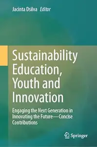

---

**Time:** 17:07:16 (Asia/Tehran)  
**Blog:** hill0  

**Title:** Practical Engineering Geology, 2nd Edition  

**Details:** English | 2024 | ISBN: 103239224X | 567 Pages | PDF (True) | 250 MB  

**Link:** http://zavat.pw/ebooks/103239224Xe.html  

---

**Time:** 17:07:16 (Asia/Tehran)  
**Blog:** hill0  

**Title:** The World Almanac and Book of Facts 2024  

**Details:** English | 2023 | ISBN: 151077761X | 1008 Pages | EPUB (True) | 135 MB  

**Link:** http://zavat.pw/ebooks/151077761Xt.html  

---

**Time:** 17:07:16 (Asia/Tehran)  
**Blog:** hill0  

**Title:** Timelines from Black History  

**Details:** English | 2020 | ISBN: 0241503612 | 96 Pages | PDF (True) | 30 MB  

**Link:** http://zavat.pw/ebooks/0241503612.html  

---

**Time:** 17:07:16 (Asia/Tehran)  
**Blog:** crazy-slim  

**Title:** Barron's - September 21, 2026  

**Details:** English | 44 pages | True PDF | 7.0 MB  

**Link:** http://zavat.pw/magazines/BarronsSeptember212026-19699.html  

---

**Time:** 17:07:16 (Asia/Tehran)  
**Blog:** crazy-slim  

**Title:** Los Angeles Times - 19 September 2026  

**Details:** English | 67 pages | True PDF | 53.8 MB  

**Link:** http://zavat.pw/newspapers/LosAngelesTimes19September2026-11457.html  

---

**Time:** 17:07:16 (Asia/Tehran)  
**Blog:** crazy-slim  

**Title:** The Baltimore Sun - 19 September 2026  

**Details:** English | 33 pages | True PDF | 33.2 MB  

**Link:** http://zavat.pw/newspapers/TheBaltimoreSun19September2026-83219.html  

---

**Time:** 17:07:16 (Asia/Tehran)  
**Blog:** crazy-slim  

**Title:** The Baltimore Sun Carroll County Times - 19 September 2026  

**Details:** English | 24 pages | True PDF | 21.8 MB  

**Link:** http://zavat.pw/newspapers/TheBaltimoreSunCarrollCountyTimes19September2026-45637.html  

---

**Time:** 17:07:16 (Asia/Tehran)  
**Blog:** crazy-slim  

**Title:** The Boston Globe - 19 September 2026  

**Details:** English | 32 pages | True PDF | 6.7 MB  

**Link:** http://zavat.pw/newspapers/TheBostonGlobe19September2026-08681.html  

---

**Time:** 13:09:21 (Asia/Tehran)  
**Blog:** AvaxGenius  

**Title:** Human* Being: On Otherkin Identity and Digital Community  

**Details:** English | PDF EPUB (True) | 2026 | 259 Pages | ISBN : 1643151037 | 7.2 MB  

**Link:** http://zavat.pw/ebooks/1643151037.html  

---

**Time:** 13:09:21 (Asia/Tehran)  
**Blog:** AvaxGenius  

**Title:** Understanding Physics (Repost)  

**Details:** English | PDF (True) | 2002 | 860 Pages | ISBN : 0387987568 | 97.8 MB  

**Link:** http://zavat.pw/ebooks/03879875628.html  

---

**Time:** 13:09:21 (Asia/Tehran)  
**Blog:** AvaxGenius  

**Title:** Raman Amplifiers for Telecommunications 1: Physical Principles  

**Details:** English | PDF(True) | 2004 | 325 Pages | ISBN : 0387007512 | 6.4 MB  

**Link:** http://zavat.pw/ebooks/03487007512.html  

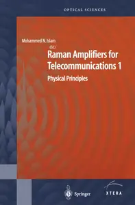

---

**Time:** 13:09:21 (Asia/Tehran)  
**Blog:** AvaxGenius  

**Title:** Long-Range Charge Transfer in DNA I  

**Details:** English | PDF(True) | 2004 | 223 Pages | ISBN : 3540201270 | 4.7 MB  

**Link:** http://zavat.pw/ebooks/35402012270.html  

---

**Time:** 13:09:21 (Asia/Tehran)  
**Blog:** AvaxGenius  

**Title:** Handbook on Knowledge Management 1: Knowledge Matters (Repost)  

**Details:** English | PDF | 2004 | 711 Pages | ISBN : 3540435271 | 5 MB  

**Link:** http://zavat.pw/ebooks/354034435271.html  

---

**Time:** 13:09:21 (Asia/Tehran)  
**Blog:** AvaxGenius  

**Title:** Raman Amplifiers for Telecommunications 2: Sub-Systems and Systems  

**Details:** English | PDF(True) | 2004 | 457 Pages | ISBN : 0387406565 | 7.1 MB  

**Link:** http://zavat.pw/ebooks/03874306565.html  

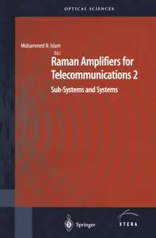

---

**Time:** 13:09:21 (Asia/Tehran)  
**Blog:** AvaxGenius  

**Title:** Computer Graphics and Geometric Modelling: Mathematics (Repost)  

**Details:** English | PDF | 2005 | 971 Pages | ISBN : 1852338172 | 5.1 MB  

**Link:** http://zavat.pw/ebooks/18525338172R.html  

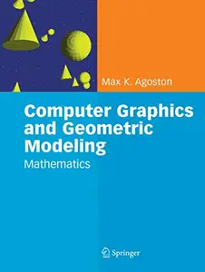

---

**Time:** 13:09:21 (Asia/Tehran)  
**Blog:** AvaxGenius  

**Title:** Lie Theory: Harmonic Analysis on Symmetric Spaces – General Plancherel Theorems  

**Details:** English | PDF(True) | 2005 | 183 Pages | ISBN : 081763777X | 1.8 MB  

**Link:** http://zavat.pw/ebooks/0817643777X.html  

---

**Time:** 13:09:21 (Asia/Tehran)  
**Blog:** AvaxGenius  

**Title:** Future Spacecraft Propulsion Systems: Enabling Technologies for Space Exploration, Second Edition  

**Details:** English | PDF(True) | 2009 | 574 Pages | ISBN : 3540888144 | 14.2 MB  

**Link:** http://zavat.pw/ebooks/3540888144.html  

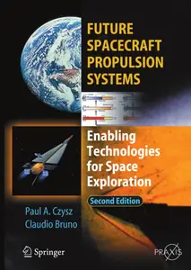

---

**Time:** 13:09:21 (Asia/Tehran)  
**Blog:** AvaxGenius  

**Title:** Deep Space Probes: To the Outer Solar System and Beyond  

**Details:** English | PDF | 2005 | 266 Pages | ISBN : 3540247726 | 3.5 MB  

**Link:** http://zavat.pw/ebooks/35450247726.html  

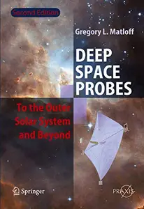

---

**Time:** 13:09:21 (Asia/Tehran)  
**Blog:** AvaxGenius  

**Title:** The International Handbook of Space Technology  

**Details:** English | PDF(True) | 2014 | 728 Pages | ISBN : 3642411002 | 32.5 MB  

**Link:** http://zavat.pw/ebooks/36424131002.html  

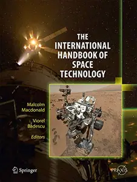

---

**Time:** 13:09:21 (Asia/Tehran)  
**Blog:** AvaxGenius  

**Title:** Use of Extraterrestrial Resources for Human Space Missions to Moon or Mars  

**Details:** English | PDF(True) | 2018 | 244 Pages | ISBN : 3319726935 | 3.7 MB  

**Link:** http://zavat.pw/ebooks/33195726935.html  

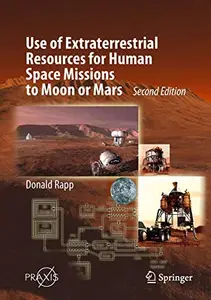

---

**Time:** 13:09:21 (Asia/Tehran)  
**Blog:** hill0  

**Title:** Applied Regression and ANOVA Using SAS  

**Details:** English | 2022 | ISBN: 1439869510 | 428 Pages | PDF EPUB (True) | 30 MB  

**Link:** http://zavat.pw/ebooks/1439869510.html  

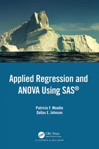

---

**Time:** 13:09:21 (Asia/Tehran)  
**Blog:** hill0  

**Title:** Genetics: From Genes to Genomes, 8th Edition  

**Details:** English | 2024 | ISBN: 1266246673 | 900 Pages | EPUB (True) | 387 MB  

**Link:** http://zavat.pw/ebooks/1266246673t.html  

---

**Time:** 13:09:21 (Asia/Tehran)  
**Blog:** hill0  

**Title:** Digital Transformation: What Kind of Smart Life do we have today?: Volume 2  

**Details:** English | 2026 | ISBN: 3032205840 | 347 Pages | PDF EPUB (True) | 29 MB  

**Link:** http://zavat.pw/ebooks/3032205840.html  

---

**Time:** 13:09:21 (Asia/Tehran)  
**Blog:** hill0  

**Title:** Advances in Computational Modeling and Structural Performance Evaluation for Civil Engineering Systems  

**Details:** English | 2026 | ISBN: 3032322367 | 630 Pages | PDF (True) | 82 MB  

**Link:** http://zavat.pw/ebooks/3032322367.html  

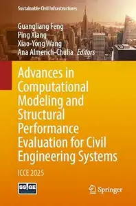

---

**Time:** 13:09:21 (Asia/Tehran)  
**Blog:** hill0  

**Title:** Intelligence Science VI  

**Details:** English | 2026 | ISBN: 3032371988 | 427 Pages | PDF (True) | 39 MB  

**Link:** http://zavat.pw/ebooks/3032371988.html  

---

**Time:** 13:09:21 (Asia/Tehran)  
**Blog:** hill0  

**Title:** Humans in Exile  

**Details:** English | 2026 | ISBN: 1009446150 | 251 Pages | PDF | 2 MB  

**Link:** http://zavat.pw/ebooks/1009446150.html  

---

**Time:** 13:09:21 (Asia/Tehran)  
**Blog:** hill0  

**Title:** International The New York Times - 19 September 2026  

**Details:** English | 20 Pages | True PDF | 12 MB  

**Link:** http://zavat.pw/newspapers/INYT-190926.html  

---

**Time:** 13:09:21 (Asia/Tehran)  
**Blog:** hill0  

**Title:** Repetitorium Krankenhaushygiene und Infektionsprävention, 4.Auflage  

**Details:** Deutsch | 2026 | ISBN: 3662727080 | 685 Pages | PDF (True) | 169 MB  

**Link:** http://zavat.pw/ebooks/3662727080.html  

---

**Time:** 13:09:21 (Asia/Tehran)  
**Blog:** hill0  

**Title:** Wendehorst Bautechnische Zahlentafeln, 38. Auflage  

**Details:** Deutsch | 2026 | ISBN: 3658470887 | 1745 Pages | PDF (True) | 187 MB  

**Link:** http://zavat.pw/ebooks/3658470887.html  

---

**Time:** 13:09:21 (Asia/Tehran)  
**Blog:** hill0  

**Title:** Markt und Maske: Kultur des Tauschs  

**Details:** Deutsch | 2026 | ISBN: 3658511761 | 377 Pages | PDF (True) | 10 MB  

**Link:** http://zavat.pw/ebooks/3658511761.html  

---

**Time:** 13:09:21 (Asia/Tehran)  
**Blog:** hill0  

**Title:** 1,000 Amazing World Facts  

**Details:** English | 2024 | ISBN: 0744092868 | 178 Pages | PDF (True) | 75 MB  

**Link:** http://zavat.pw/ebooks/0744092868.html  

---

**Time:** 13:09:21 (Asia/Tehran)  
**Blog:** hill0  

**Title:** 15 Minute Arabic: Learn in Just 12 Weeks  

**Details:** English | 2024 | ISBN: 0744085020 | 162 Pages | PDF (True) | 50 MB  

**Link:** http://zavat.pw/ebooks/0744085020.html  

---

**Time:** 13:09:21 (Asia/Tehran)  
**Blog:** hill0  

**Title:** Le Temps Magazine - 20 Septembre 2026  

**Details:** Français | 68 pages | True PDF | 24 MB  

**Link:** http://zavat.pw/magazines/t-magazine-20260919.html  

---

**Time:** 13:09:21 (Asia/Tehran)  
**Blog:** hill0  

**Title:** Advances in Smart Computing and Emerging Technologies  

**Details:** English | 2026 | ISBN: 3032191599 | 495 Pages | PDF (True) | 24 MB  

**Link:** http://zavat.pw/ebooks/3032191599.html  

---

**Time:** 13:09:21 (Asia/Tehran)  
**Blog:** hill0  

**Title:** Pluralism and Complexity  

**Details:** English | 2026 | ISBN: 1009675583 | 435 Pages | PDF | 2 MB  

**Link:** http://zavat.pw/ebooks/1009675583.html  

---

**Time:** 13:09:21 (Asia/Tehran)  
**Blog:** crazy-slim  

**Title:** Virginia Gazette - 19 September 2026  

**Details:** English | 26 pages | True PDF | 29.8 MB  

**Link:** http://zavat.pw/newspapers/VirginiaGazette19September2026-50368.html  

---

**Time:** 13:09:21 (Asia/Tehran)  
**Blog:** crazy-slim  

**Title:** The Morning Call Morning Edition - 19 September 2026  

**Details:** English | 25 pages | True PDF | 16.2 MB  

**Link:** http://zavat.pw/newspapers/TheMorningCallMorningEdition19September2026-53639.html  

---

**Time:** 13:09:21 (Asia/Tehran)  
**Blog:** crazy-slim  

**Title:** The Philadelphia Inquirer - September 19, 2026  

**Details:** English | 24 pages | True PDF | 19.6 MB  

**Link:** http://zavat.pw/newspapers/ThePhiladelphiaInquirerSeptember192026-01767.html  

---

**Time:** 13:09:21 (Asia/Tehran)  
**Blog:** crazy-slim  

**Title:** The Dallas Morning News - September 19, 2026  

**Details:** English | 34 pages | True PDF | 17.1 MB  

**Link:** http://zavat.pw/newspapers/TheDallasMorningNewsSeptember192026-28831.html  

---

**Time:** 13:09:21 (Asia/Tehran)  
**Blog:** crazy-slim  

**Title:** USA Today - September 19, 2026  

**Details:** English | 12 pages | True PDF | 4.4 MB  

**Link:** http://zavat.pw/newspapers/USATodaySeptember192026-27061.html  

---

**Time:** 13:09:21 (Asia/Tehran)  
**Blog:** crazy-slim  

**Title:** Sun Sentinel - 19 September 2026  

**Details:** English | 28 pages | True PDF | 17.1 MB  

**Link:** http://zavat.pw/newspapers/SunSentinel19September2026-41778.html  

---

**Time:** 13:09:21 (Asia/Tehran)  
**Blog:** crazy-slim  

**Title:** Hartford Courant - 19 September 2026  

**Details:** English | 24 pages | True PDF | 44.4 MB  

**Link:** http://zavat.pw/newspapers/HartfordCourant19September2026-79424.html  

---

**Time:** 13:09:21 (Asia/Tehran)  
**Blog:** crazy-slim  

**Title:** Post-Tribune - 19 September 2026  

**Details:** English | 20 pages | True PDF | 14.6 MB  

**Link:** http://zavat.pw/newspapers/PostTribune19September2026-15246.html  

---

**Time:** 13:09:21 (Asia/Tehran)  
**Blog:** crazy-slim  

**Title:** Orlando Sentinel - 19 September 2026  

**Details:** English | 33 pages | True PDF | 21.1 MB  

**Link:** http://zavat.pw/newspapers/OrlandoSentinel19September2026-22507.html  

---

**Time:** 13:09:21 (Asia/Tehran)  
**Blog:** crazy-slim  

**Title:** Newsday - 19 September 2026  

**Details:** English | 48 pages | True PDF | 20.0 MB  

**Link:** http://zavat.pw/newspapers/Newsday19September2026-64225.html  

---

**Time:** 13:09:21 (Asia/Tehran)  
**Blog:** crazy-slim  

**Title:** Daily Press - 19 September 2026  

**Details:** English | 78 pages | True PDF | 31.3 MB  

**Link:** http://zavat.pw/newspapers/DailyPress19September2026-83948.html  

---

**Time:** 13:09:21 (Asia/Tehran)  
**Blog:** crazy-slim  

**Title:** Lake County News-Sun - 19 September 2026  

**Details:** English | 20 pages | True PDF | 13.1 MB  

**Link:** http://zavat.pw/newspapers/LakeCountyNewsSun19September2026-11451.html  

---

**Time:** 13:09:21 (Asia/Tehran)  
**Blog:** crazy-slim  

**Title:** Chicago Tribune - 19 September 2026  

**Details:** English | 26 pages | True PDF | 15.6 MB  

**Link:** http://zavat.pw/newspapers/ChicagoTribune19September2026-72598.html  

---

**Time:** 13:09:21 (Asia/Tehran)  
**Blog:** crazy-slim  

**Title:** National Geographic Italia - Settembre 2022  

**Details:** Italiano | 132 pages | True PDF | 125.2 MB  

**Link:** http://zavat.pw/magazines/NationalGeographicItaliaSettembre2022-98378.html  

---

**Time:** 13:09:21 (Asia/Tehran)  
**Blog:** crazy-slim  

**Title:** National Geographic Italia - Ottobre 2022  

**Details:** Italiano | 144 pages | True PDF | 60.0 MB  

**Link:** http://zavat.pw/magazines/NationalGeographicItaliaOttobre2022-48221.html  

---

**Time:** 08:52:45 (Asia/Tehran)  
**Blog:** IrGens  

**Title:** Microsoft Windows Server Hybrid Administrator (AZ-802) Cert Prep by Microsoft Press  

**Details:** .MP4, AVC, 1280x720, 30 fps | English, AAC, 2 Ch | 8h 8m | 960 MB  

**Link:** http://zavat.pw/ebooks/microsoft-windows-server-hybrid-administrator-az-802-cert-prep-by-microsoft-press.html  

---

**Time:** 08:52:45 (Asia/Tehran)  
**Blog:** IrGens  

**Title:** Complete Guide to Python for Data Engineering: From Beginner to Advanced [Updated: 9/8/2026]  

**Details:** .MP4, AVC, 1280x720, 30 fps | English, AAC, 2 Ch | 5h 26m | 584 MB  

**Link:** http://zavat.pw/ebooks/complete-guide-to-python-for-data-engineering-from-beginner-to-advanced-982026.html  

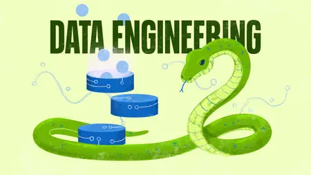

---

**Time:** 08:52:45 (Asia/Tehran)  
**Blog:** IrGens  

**Title:** Managing Stress in an Always-On Workplace  

**Details:** .MP4, AVC, 1280x720, 30 fps | English, AAC, 2 Ch | 38m | 146 MB  

**Link:** http://zavat.pw/ebooks/managing-stress-in-an-always-on-workplace.html  

---

**Time:** 08:52:45 (Asia/Tehran)  
**Blog:** AvaxGenius  

**Title:** Space Mining and Its Regulation  

**Details:** English | PDF(True) | 2017 | 203 Pages | ISBN : 331939245X | 9.6 MB  

**Link:** http://zavat.pw/ebooks/3319339245X.html  

---

**Time:** 08:52:45 (Asia/Tehran)  
**Blog:** AvaxGenius  

**Title:** Advances in Solar Sailing  

**Details:** English | PDF(True) | 2014 | 973 Pages | ISBN : 3642349064 | 75.3 MB  

**Link:** http://zavat.pw/ebooks/36423439064.html  

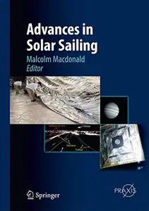

---

**Time:** 08:52:45 (Asia/Tehran)  
**Blog:** AvaxGenius  

**Title:** Interplanetary Mission Analysis and Design  

**Details:** English | PDF(True) | 2006 | 511 Pages | ISBN : 3540299130 | 9.4 MB  

**Link:** http://zavat.pw/ebooks/3540299130T.html  

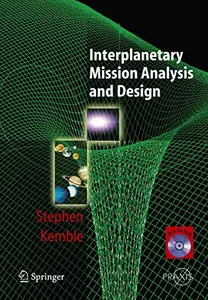

---

**Time:** 08:52:45 (Asia/Tehran)  
**Blog:** AvaxGenius  

**Title:** Space 2.0: Revolutionary Advances in the Space Industry  

**Details:** English | PDF(True) | 2019 | 222 Pages | ISBN : 3030152804 | 8.2 MB  

**Link:** http://zavat.pw/ebooks/3030152804T.html  

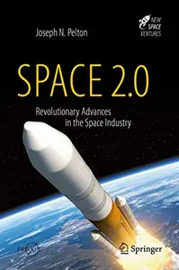

---

**Time:** 08:52:45 (Asia/Tehran)  
**Blog:** crazy-slim  

**Title:** La Dépêche du Midi Gers - 19 September 2026  

**Details:** Français | 34 pages | PDF | 40.9 MB  

**Link:** http://zavat.pw/newspapers/LaD%C3%A9p%C3%AAcheduMidiGers19September2026-96203.html  

---

**Time:** 08:52:45 (Asia/Tehran)  
**Blog:** crazy-slim  

**Title:** La Dépêche du Midi Comminges - 19 September 2026  

**Details:** Français | 34 pages | PDF | 40.2 MB  

**Link:** http://zavat.pw/newspapers/LaD%C3%A9p%C3%AAcheduMidiComminges19September2026-04251.html  

---

**Time:** 08:52:45 (Asia/Tehran)  
**Blog:** crazy-slim  

**Title:** The Times - 19 September 2026  

**Details:** English | 232 pages | True PDF | 240.9 MB  

**Link:** http://zavat.pw/newspapers/TheTimes19September2026-80792.html  

---

**Time:** 08:52:45 (Asia/Tehran)  
**Blog:** crazy-slim  

**Title:** La Dépêche du Midi Aveyron - 19 September 2026  

**Details:** Français | 36 pages | PDF | 44.3 MB  

**Link:** http://zavat.pw/newspapers/LaD%C3%A9p%C3%AAcheduMidiAveyron19September2026-94451.html  

---

**Time:** 08:52:45 (Asia/Tehran)  
**Blog:** crazy-slim  

**Title:** La Dépêche du Midi Aude - 19 September 2026  

**Details:** Français | 36 pages | PDF | 45.0 MB  

**Link:** http://zavat.pw/newspapers/LaD%C3%A9p%C3%AAcheduMidiAude19September2026-62402.html  

---

**Time:** 08:52:45 (Asia/Tehran)  
**Blog:** crazy-slim  

**Title:** La Dépêche du Midi Ariège - 19 September 2026  

**Details:** Français | 34 pages | PDF | 39.3 MB  

**Link:** http://zavat.pw/newspapers/LaD%C3%A9p%C3%AAcheduMidiAri%C3%A8ge19September2026-55062.html  

---

**Time:** 08:52:45 (Asia/Tehran)  
**Blog:** crazy-slim  

**Title:** L'Indépendant Narbonne - 19 September 2026  

**Details:** Français | 30 pages | PDF | 39.0 MB  

**Link:** http://zavat.pw/newspapers/LInd%C3%A9pendantNarbonne19September2026-98140.html  

---

**Time:** 08:52:45 (Asia/Tehran)  
**Blog:** crazy-slim  

**Title:** L'Indépendant Catalan - 19 September 2026  

**Details:** Français | 36 pages | PDF | 48.3 MB  

**Link:** http://zavat.pw/newspapers/LInd%C3%A9pendantCatalan19September2026-52344.html  

---

**Time:** 08:52:45 (Asia/Tehran)  
**Blog:** crazy-slim  

**Title:** L'Indépendant Carcassonne - 19 September 2026  

**Details:** Français | 30 pages | PDF | 39.5 MB  

**Link:** http://zavat.pw/newspapers/LInd%C3%A9pendantCarcassonne19September2026-18686.html  

---

**Time:** 08:52:45 (Asia/Tehran)  
**Blog:** crazy-slim  

**Title:** France-Antilles Guadeloupe - 19 September 2026  

**Details:** Français | 40 pages | PDF | 45.9 MB  

**Link:** http://zavat.pw/newspapers/FranceAntillesGuadeloupe19September2026-43293.html  

---

**Time:** 08:52:45 (Asia/Tehran)  
**Blog:** crazy-slim  

**Title:** Centre Presse Aveyron - 19 September 2026  

**Details:** Français | 30 pages | PDF | 36.7 MB  

**Link:** http://zavat.pw/newspapers/CentrePresseAveyron19September2026-16175.html  

---

**Time:** 08:52:45 (Asia/Tehran)  
**Blog:** crazy-slim  

**Title:** The Sun UK - 19 September 2026  

**Details:** English | 100 pages | True PDF | 151.5 MB  

**Link:** http://zavat.pw/newspapers/TheSunUK19September2026-73794.html  

---

**Time:** 08:52:45 (Asia/Tehran)  
**Blog:** crazy-slim  

**Title:** Toowoomba Chronicle - September 19, 2026  

**Details:** English | 100 pages | True PDF | 91.2 MB  

**Link:** http://zavat.pw/newspapers/ToowoombaChronicleSeptember192026-54389.html  

---

**Time:** 08:52:45 (Asia/Tehran)  
**Blog:** crazy-slim  

**Title:** Townsville Bulletin - September 19, 2026  

**Details:** English | 100 pages | True PDF | 75.0 MB  

**Link:** http://zavat.pw/newspapers/TownsvilleBulletinSeptember192026-20861.html  

---

**Time:** 08:52:45 (Asia/Tehran)  
**Blog:** crazy-slim  

**Title:** The Teesside Gazette - 19 September 2026  

**Details:** English | 80 pages | True PDF | 56.4 MB  

**Link:** http://zavat.pw/newspapers/TheTeessideGazette19September2026-96862.html  

---

**Time:** 04:21:36 (Asia/Tehran)  
**Blog:** IrGens  

**Title:** Practical Deep Agents: Implementing Autonomous Problem-Solving Loops  

**Details:** .MP4, AVC, 1280x720, 30 fps | English, AAC, 2 Ch | 2h 42m | 483 MB  

**Link:** http://zavat.pw/ebooks/practical-deep-agents-implementing-autonomous-problem-solving-loops.html  

---

**Time:** 04:21:36 (Asia/Tehran)  
**Blog:** IrGens  

**Title:** The AI Sparring Partner: Using AI Prompting to Think Critically  

**Details:** .MP4, AVC, 1280x720, 30 fps | English, AAC, 2 Ch | 52m | 217 MB  

**Link:** http://zavat.pw/ebooks/the-ai-sparring-partner-using-ai-prompting-to-think-critically.html  

---

**Time:** 04:21:36 (Asia/Tehran)  
**Blog:** IrGens  

**Title:** Training Neural Networks in Python [Updated: 9/11/2026]  

**Details:** .MP4, AVC, 1280x720, 30 fps | English, AAC, 2 Ch | 2h 5m | 254 MB  

**Link:** http://zavat.pw/ebooks/training-neural-networks-in-python-17058600-up.html  

---

**Time:** 04:21:36 (Asia/Tehran)  
**Blog:** IrGens  

**Title:** AI Reasoning Models: The Building Blocks for the Next Generation of AI Applications  

**Details:** .MP4, AVC, 1280x720, 30 fps | English, AAC, 2 Ch | 1h 7m | 209 MB  

**Link:** http://zavat.pw/ebooks/ai-reasoning-models-the-building-blocks-for-the-next-generation-of-ai-applications.html  

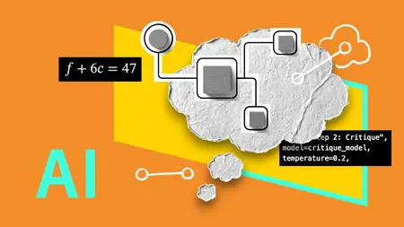

---

**Time:** 04:21:36 (Asia/Tehran)  
**Blog:** IrGens  

**Title:** Claude Agents: Build a Multi-Agent Research System in 7 Days  

**Details:** .MP4, AVC, 1280x720, 30 fps | English, AAC, 2 Ch | 47m | 206 MB  

**Link:** http://zavat.pw/ebooks/claude-agents-build-a-multi-agent-research-system-in-7-days.html  

---

**Time:** 04:21:36 (Asia/Tehran)  
**Blog:** IrGens  

**Title:** 15 Claude for Excel Productivity Tips  

**Details:** .MP4, AVC, 640x1138, 30 fps | English, AAC, 2 Ch | 21m | 86.1 MB  

**Link:** http://zavat.pw/ebooks/15-claude-for-excel-productivity-tips.html  

---

**Time:** 04:21:36 (Asia/Tehran)  
**Blog:** IrGens  

**Title:** Agentic Artificial Intelligence: Harnessing AI Agents to Reinvent Business, Work, and Life  

**Details:** .MP4, AVC, 1280x720, 30 fps | English, AAC, 2 Ch | 56m | 225 MB  

**Link:** http://zavat.pw/ebooks/agentic-artificial-intelligence-harnessing-ai-agents-to-reinvent-business-work-and-life.html  

---

**Time:** 02:13:04 (Asia/Tehran)  
**Blog:** IrGens  

**Title:** 15 ChatGPT for Excel Productivity Tips  

**Details:** .MP4, AVC, 640x1138, 30 fps | English, AAC, 2 Ch | 21m | 85.6 MB  

**Link:** http://zavat.pw/ebooks/15-chatgpt-for-excel-productivity-tips.html  

---

**Time:** 02:13:04 (Asia/Tehran)  
**Blog:** IrGens  

**Title:** Claude Code for Data Analysts: Clean, Analyze, and Communicate Data with AI  

**Details:** .MP4, AVC, 1280x720, 30 fps | English, AAC, 2 Ch | 57m | 162 MB  

**Link:** http://zavat.pw/ebooks/claude-code-for-data-analysts-clean-analyze-and-communicate-data-with-ai.html  

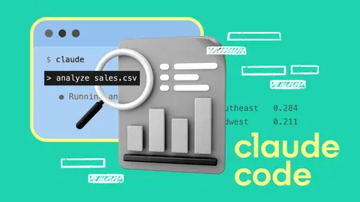

---

**Time:** 02:13:04 (Asia/Tehran)  
**Blog:** IrGens  

**Title:** AI Workflows for Data Analysts: Build Context, Prompts, and Reliable Insights  

**Details:** .MP4, AVC, 1280x720, 30 fps | English, AAC, 2 Ch | 44m | 137 MB  

**Link:** http://zavat.pw/ebooks/ai-workflows-for-data-analysts-build-context-prompts-and-reliable-insights.html  

---

**Time:** 02:13:04 (Asia/Tehran)  
**Blog:** AvaxGenius  

**Title:** Gears in Design, Production and Education: A Tribute to Prof. Veniamin Goldfarb (Repost)  

**Details:** English | EPUB(True) | 2021 | 445 Pages | ISBN : 3030730212 | 98.3 MB  

**Link:** http://zavat.pw/ebooks/303043730212.html  

---

**Time:** 02:13:04 (Asia/Tehran)  
**Blog:** AvaxGenius  

**Title:** Robotics for Sustainable Future: CLAWAR 2021 (Repost)  

**Details:** English | EPUB | 2022 | 508 Pages | ISBN : 3030862933 | 139.6 MB  

**Link:** http://zavat.pw/ebooks/303308629343.html  

---

**Time:** 02:13:04 (Asia/Tehran)  
**Blog:** AvaxGenius  

**Title:** Ocular Oncology (Repost)  

**Details:** English | EPUB | 2019 | 158 Pages | ISBN : 9811323356 | 96.7 MB  

**Link:** http://zavat.pw/ebooks/984311323356.html  

---

**Time:** 02:13:04 (Asia/Tehran)  
**Blog:** AvaxGenius  

**Title:** Enhancing Biomedical Education: Integrating Digital Visualization and 3D Technologies (Repost)  

**Details:** English | PDF EPUB (True) | 2025 | 382 Pages | ISBN : 3031732693 | 129.4 MB  

**Link:** http://zavat.pw/ebooks/303431732693.html  

---

**Time:** 02:13:04 (Asia/Tehran)  
**Blog:** AvaxGenius  

**Title:** Encyclopedia of Otolaryngology, Head and Neck Surgery (Repost)  

**Details:** English | PDF | 2013 | 3119 Pages | ISBN : 3642234984 | 101 MB  

**Link:** http://zavat.pw/ebooks/364223443984.html  

---

**Time:** 02:13:04 (Asia/Tehran)  
**Blog:** AvaxGenius  

**Title:** Hydro-Climatic Extremes in the Anthropocene (Repost)  

**Details:** English | EPUB (True) | 2023 | 462 Pages | ISBN : 3031377265 | 136.3 MB  

**Link:** http://zavat.pw/ebooks/303143377265.html  

---

**Time:** 02:13:04 (Asia/Tehran)  
**Blog:** AvaxGenius  

**Title:** Laparoscopic Pelvic Anatomy in Females: Applied Surgical Principles (Repost)  

**Details:** English | PDF | 2019 | 288 Pages | ISBN : 9811386528 | 155.5 MB  

**Link:** http://zavat.pw/ebooks/981134386528.html  

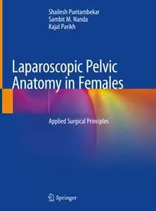

---

**Time:** 02:13:04 (Asia/Tehran)  
**Blog:** AvaxGenius  

**Title:** R3 in Geomatics: Research, Results and Review (Repost)  

**Details:** English | PDF | 2020 | 400 Pages | ISBN : 3030627993 | 107.9 MB  

**Link:** http://zavat.pw/ebooks/303064327993.html  

---

**Time:** 02:13:04 (Asia/Tehran)  
**Blog:** AvaxGenius  

**Title:** Groundwater and Society: Applications of Geospatial Technology (Repost)  

**Details:** English | EPUB | 2021 | 535 Pages | ISBN : 303064135X | 154.5 MB  

**Link:** http://zavat.pw/ebooks/30306414335X.html  

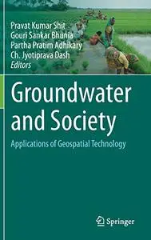

---

**Time:** 02:13:04 (Asia/Tehran)  
**Blog:** AvaxGenius  

**Title:** Distinguished Figures in Mechanical Engineering in Spain and Ibero-America (Repost)  

**Details:** English | PDF EPUB (True) | 2023 | 376 Pages | ISBN : 3031310748 | 125.3 MB  

**Link:** http://zavat.pw/ebooks/303431310748.html  

---

**Time:** 02:13:04 (Asia/Tehran)  
**Blog:** AvaxGenius  

**Title:** Smart Technologies in Urban Engineering: Proceedings of STUE-2023, Volume 1 (Repost)  

**Details:** English | PDF EPUB (True) | 2023 | 496 Pages | ISBN : 3031468732 | 164.4 MB  

**Link:** http://zavat.pw/ebooks/303146438732.html  

---

**Time:** 02:13:04 (Asia/Tehran)  
**Blog:** AvaxGenius  

**Title:** Atlas of Mohs and Frozen Section Cutaneous Pathology, Second Edition (Repost)  

**Details:** English | EPUB | 2018 | 253 Pages | ISBN : 3319748467 | 219 MB  

**Link:** http://zavat.pw/ebooks/533197484672.html  

---

**Time:** 02:13:04 (Asia/Tehran)  
**Blog:** AvaxGenius  

**Title:** Atlas of Dermatologic Ultrasound (Repost)  

**Details:** English | EPUB | 2018 | 374 Pages | ISBN : 331989613X | 400.8 MB  

**Link:** http://zavat.pw/ebooks/33198439613X.html  

---

**Time:** 02:13:04 (Asia/Tehran)  
**Blog:** AvaxGenius  

**Title:** 15th European Workshop on Advanced Control and Diagnosis (ACD 2019) (Repost)  

**Details:** English | EPUB | 2022 | 1441 Pages | ISBN : 3030853179 | 215.7 MB  

**Link:** http://zavat.pw/ebooks/302308531739.html  

---

**Time:** 02:13:04 (Asia/Tehran)  
**Blog:** AvaxGenius  

**Title:** Date Palm Byproducts: A Springboard for Circular Bio Economy (Repost)  

**Details:** English | EPUB (True) | 2023 | 392 Pages | ISBN : 9819904749 | 115.9 MB  

**Link:** http://zavat.pw/ebooks/981990247494.html  

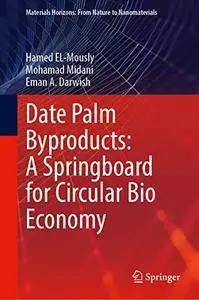

---

**Time:** 02:13:04 (Asia/Tehran)  
**Blog:** hill0  

**Title:** Timelines of Everyone: From Cleopatra and Confucius to Mozart and Malala  

**Details:** English | 2020 | ISBN: 1465499962 | 320 Pages | True PDF | 106 MB  

**Link:** http://zavat.pw/ebooks/1465499962P.html  

---

**Time:** 02:13:04 (Asia/Tehran)  
**Blog:** hill0  

**Title:** Veterinary Psychiatry of the Cat  

**Details:** English | 2026 | ISBN: 3032062594 | 926 Pages | EPUB (True) | 123 MB  

**Link:** http://zavat.pw/ebooks/3032062594E.html  

