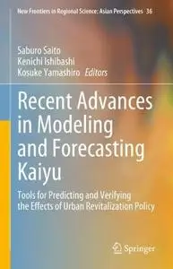
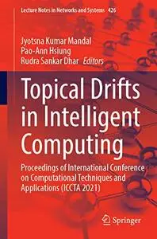

# Zavat feed - 2026-09-20

---

**Time:** 03:19:27 (Asia/Tehran)  
**Blog:** AvaxGenius  

**Title:** FOTOPROFI Magazin - No.198, 2026  

**Details:** Deutsch | True PDF | 27 Pages | 45.8 MB  

**Link:** http://zavat.pw/magazines/FOTOPROFIMagazinNo198_2026.html  

---

**Time:** 03:19:27 (Asia/Tehran)  
**Blog:** AvaxGenius  

**Title:** FOTOPROFI Magazin - No.197, 2026  

**Details:** Deutsch | True PDF | 30 Pages | 37.5 MB  

**Link:** http://zavat.pw/magazines/FOTOPROFIMagazinNo197_2026.html  

---

**Time:** 03:19:27 (Asia/Tehran)  
**Blog:** AvaxGenius  

**Title:** Recent Advances in Modeling and Forecasting Kaiyu (Repost)  

**Details:** English | EPUB (True) | 2023 | 620 Pages | ISBN : 9819912407 | 101.6 MB  

**Link:** http://zavat.pw/ebooks/981991432407.html  

---

**Time:** 03:19:27 (Asia/Tehran)  
**Blog:** AvaxGenius  

**Title:** Advances in Critical Flow Dynamics Involving Moving/Deformable Structures with Design Applications (Repost)  

**Details:** English | EPUB | 2021 | 579 Pages | ISBN : 3030555933 | 159.8 MB  

**Link:** http://zavat.pw/ebooks/303405559343.html  

---

**Time:** 03:19:27 (Asia/Tehran)  
**Blog:** AvaxGenius  

**Title:** Sensors and Instrumentation, Aircraft/Aerospace, Energy Harvesting & Dynamic Environments Testing, Volume 7 (Repost)  

**Details:** English | EPUB | 2021 | 286 Pages | ISBN : 3030477126 | 134 MB  

**Link:** http://zavat.pw/ebooks/340304774126.html  

---

**Time:** 03:19:27 (Asia/Tehran)  
**Blog:** AvaxGenius  

**Title:** Proceedings of 2021 Chinese Intelligent Systems Conference: Volume II (Repost)  

**Details:** English | PDF (True) | 2021 | 866 Pages | ISBN : 9811663238 | 111.9 MB  

**Link:** http://zavat.pw/ebooks/981164363238.html  

---

**Time:** 03:19:27 (Asia/Tehran)  
**Blog:** AvaxGenius  

**Title:** Innovations in Smart Cities Applications Volume 4 (Repost)  

**Details:** English | PDF (True) | 2021 | 1529 Pages | ISBN : 3030668398 | 215.9 MB  

**Link:** http://zavat.pw/ebooks/304306683498.html  

---

**Time:** 03:19:27 (Asia/Tehran)  
**Blog:** AvaxGenius  

**Title:** Design and Development of Aerospace Vehicles and Propulsion Systems: Proceedings of SAROD 2018 (Repost)  

**Details:** English | EPUB | 2021 | 529 Pages | ISBN : 981159600X | 194.2 MB  

**Link:** http://zavat.pw/ebooks/98115964100X.html  

---

**Time:** 03:19:27 (Asia/Tehran)  
**Blog:** AvaxGenius  

**Title:** Hydrological Modelling and the Water Cycle: Coupling the Atmospheric and Hydrological Models (Repost)  

**Details:** English | PDF | 2008 | 293 Pages | ISBN : 354077842X | 106.6 MB  

**Link:** http://zavat.pw/ebooks/35434077842X.html  

---

**Time:** 03:19:27 (Asia/Tehran)  
**Blog:** AvaxGenius  

**Title:** Innovations in Computer Science and Engineering: Proceedings of the Tenth ICICSE, 2022 (Repost)  

**Details:** English | EPUB (True) | 2023 | 754 Pages | ISBN : 9811974543 | 100 MB  

**Link:** http://zavat.pw/ebooks/981143974543.html  

---

**Time:** 03:19:27 (Asia/Tehran)  
**Blog:** AvaxGenius  

**Title:** Digital Management of Container Terminal Operations (Repost)  

**Details:** English | EPUB | 2020 | 317 Pages | ISBN : 9811529361 | 103.8 MB  

**Link:** http://zavat.pw/ebooks/984311529361.html  

---

**Time:** 03:19:27 (Asia/Tehran)  
**Blog:** AvaxGenius  

**Title:** Topical Drifts in Intelligent Computing (Repost)  

**Details:** English | PDF,EPUB | 2022 | 625 Pages | ISBN : 9811907447 | 144 MB  

**Link:** http://zavat.pw/ebooks/981190743447.html  

---

**Time:** 03:19:27 (Asia/Tehran)  
**Blog:** AvaxGenius  

**Title:** Transport Transitions: Advancing Sustainable and Inclusive Mobility (Repost)  

**Details:** English | PDF EPUB (True) | 2026 | 882 Pages | ISBN : 3031889738 | 193.9 MB  

**Link:** http://zavat.pw/ebooks/303184389738.html  

---

**Time:** 03:19:27 (Asia/Tehran)  
**Blog:** AvaxGenius  

**Title:** The Firebird Book: A Reference for Database Developers (Repost)  

**Details:** English | PDF | 2004 | 1088 Pages | ISBN : 1590592794 | 107.9 MB  

**Link:** http://zavat.pw/ebooks/159430592794.html  

---

**Time:** 03:19:27 (Asia/Tehran)  
**Blog:** AvaxGenius  

**Title:** Illustrated Pollen Terminology, Second Edition (Repost)  

**Details:** English | PDF | 2018 | 487 Pages | ISBN : 3319713647 | 112.56 MB  

**Link:** http://zavat.pw/ebooks/331943713647.html  

---

**Time:** 01:04:03 (Asia/Tehran)  
**Blog:** hill0  

**Title:** Bridging History and Policy  

**Details:** English | 2026 | ISBN: 3032243785 | 486 Pages | PDF (True) | 30 MB  

**Link:** http://zavat.pw/ebooks/3032243785.html  

---

**Time:** 01:04:03 (Asia/Tehran)  
**Blog:** hill0  

**Title:** Ultimate Japan: 100 Must-do Experiences for the Trip of a Lifetime  

**Details:** English | 2025 | ISBN: 0241760313 | 386 Pages | EPUB (True) | 144 MB  

**Link:** http://zavat.pw/ebooks/0241760313e.html  

