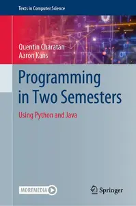
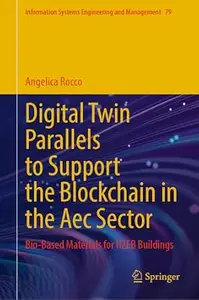
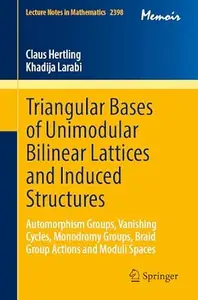

# Zavat feed - 2026-09-24

---

**Time:** 02:53:25 (Asia/Tehran)  
**Blog:** AvaxGenius  

**Title:** Programming in Two Semesters: Using Python and Java (Repost)  

**Details:** English | EPUB (True) | 2022 | 665 Pages | ISBN : 3031013255 | 152.1 MB  

**Link:** http://zavat.pw/ebooks/303101243255.html  

---

**Time:** 00:25:43 (Asia/Tehran)  
**Blog:** hill0  

**Title:** Digital Twin Parallels to Support the Blockchain in the Aec Sector  

**Details:** English | 2026 | ISBN: 3032152666 | 269 Pages | PDF EPUB (True) | 74 MB  

**Link:** http://zavat.pw/ebooks/3032152666.html  

---

**Time:** 00:25:43 (Asia/Tehran)  
**Blog:** hill0  

**Title:** Triangular Bases of Unimodular Bilinear Lattices and Induced Structures  

**Details:** English | 2026 | ISBN: 3032259967 | 387 Pages | PDF EPUB (True) | 36 MB  

**Link:** http://zavat.pw/ebooks/3032259967.html  

---

**Time:** 00:25:43 (Asia/Tehran)  
**Blog:** hill0  

**Title:** 1,000 Amazing Dinosaur Facts  

**Details:** English | 2023 | ISBN: 074406967X | 178 Pages | PDF (True) | 93 MB  

**Link:** http://zavat.pw/ebooks/074406967X.html  

