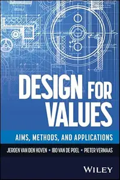
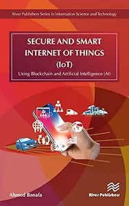
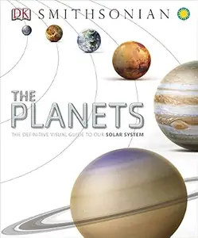
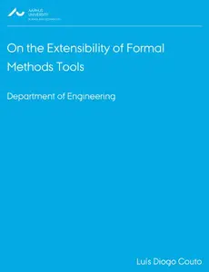
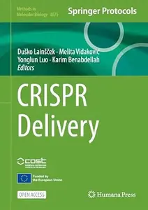
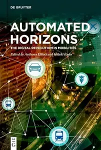

# Zavat feed - 2026-09-27

---

**Time:** 22:06:37 (Asia/Tehran)  
**Blog:** hill0  

**Title:** The Geopolitics of Maritime Areas  

**Details:** English | 2026 | ISBN: 3032242266 | 339 Pages | PDF (True) | 14 MB  

**Link:** http://zavat.pw/ebooks/3032242266.html  

---

**Time:** 22:06:37 (Asia/Tehran)  
**Blog:** hill0  

**Title:** Bird: The Definitive Visual Guide  

**Details:** English | 2022 | ISBN: 0744039584 | 514 Pages | PDF (True) | 122 MB  

**Link:** http://zavat.pw/ebooks/0744039584.html  

---

**Time:** 22:06:37 (Asia/Tehran)  
**Blog:** hill0  

**Title:** Design For Values: Aims, Methods, and Applications  

**Details:** English | 2027 | ISBN: 1394427247 | 254 Pages | EPUB (True) | 4 MB  

**Link:** http://zavat.pw/ebooks/1394427247.html  

---

**Time:** 22:06:37 (Asia/Tehran)  
**Blog:** hill0  

**Title:** Secure and Smart Internet of Things (IoT)  

**Details:** English | 2019 | ISBN: 8770220301 | 177 Pages | EPUB (True) | 5 MB  

**Link:** http://zavat.pw/ebooks/8770220301e.html  

---

**Time:** 22:06:37 (Asia/Tehran)  
**Blog:** hill0  

**Title:** The Planets: The Definitive Visual Guide to Our Solar System  

**Details:** English | 2014 | ISBN: 1465424644 | 256 Pages | PDF (True) | 118 MB  

**Link:** http://zavat.pw/ebooks/1465424644t.html  

---

**Time:** 22:06:37 (Asia/Tehran)  
**Blog:** hill0  

**Title:** Development Across the Life Span (10th Edition)  

**Details:** English | 2023 | ISBN: 0137890591 | 785 Pages | PDF (True) | 90 MB  

**Link:** http://zavat.pw/ebooks/0137890591.html  

---

**Time:** 22:06:37 (Asia/Tehran)  
**Blog:** hill0  

**Title:** Psychological Disorders: A Scientist-Practitioner Approach (5th Edition)  

**Details:** English | 2023 | ISBN: 0137833563 | 718 Pages | PDF (True) | 35 MB  

**Link:** http://zavat.pw/ebooks/0137833563.html  

---

**Time:** 22:06:37 (Asia/Tehran)  
**Blog:** hill0  

**Title:** Laser Induced Breakdown Spectroscopy (LIBS): Concepts, Instrumentation, Data Analysis and Applications, 2 Volume Set  

**Details:** English | 2023 | ISBN: 1119758408 | 960 Pages | PDF | 16 MB  

**Link:** http://zavat.pw/ebooks/1119758408.html  

---

**Time:** 17:59:56 (Asia/Tehran)  
**Blog:** AvaxGenius  

**Title:** Cyber Defense - September 2026  

**Details:** English | True PDF | 341 Pages | 40 MB  

**Link:** http://zavat.pw/magazines/CyberDefenseSeptember2026.html  

---

**Time:** 17:59:56 (Asia/Tehran)  
**Blog:** AvaxGenius  

**Title:** Cyber Defense - August 2026  

**Details:** English | True PDF | 368 Pages | 40.2 MB  

**Link:** http://zavat.pw/magazines/CyberDefenseAugust2026.html  

---

**Time:** 17:59:56 (Asia/Tehran)  
**Blog:** AvaxGenius  

**Title:** Electrical Engineering - July/August 2026  

**Details:** English | True PDF | 48 Pages | 17.7 MB  

**Link:** http://zavat.pw/magazines/ElectricalEngineeringJulyAugust2026.html  

---

**Time:** 17:59:56 (Asia/Tehran)  
**Blog:** AvaxGenius  

**Title:** Electronics World - July/August 2026  

**Details:** English | True PDF | 44 Pages | 6.7 MB  

**Link:** http://zavat.pw/magazines/ElectronicsWorldJulyAugust2026.html  

---

**Time:** 17:59:56 (Asia/Tehran)  
**Blog:** AvaxGenius  

**Title:** Shipwreck Archaeology in China Sea (Repost)  

**Details:** English | EPUB | 2022 | 290 Pages | ISBN : 9811686742 | 141.9 MB  

**Link:** http://zavat.pw/ebooks/9811643286742.html  

---

**Time:** 17:59:56 (Asia/Tehran)  
**Blog:** AvaxGenius  

**Title:** Adult CNS Radiation Oncology: Principles and Practice (Repost)  

**Details:** English | EPUB | 2018 | 746 Pages | ISBN : 3319428772 | 150.2 MB  

**Link:** http://zavat.pw/ebooks/331294284772.html  

---

**Time:** 17:59:56 (Asia/Tehran)  
**Blog:** AvaxGenius  

**Title:** Russian Space Probes: Scientific Discoveries and Future Missions (Repost)  

**Details:** English | PDF (True) | 2011 | 541 Pages | ISBN : 1441981497 | 166.6 MB  

**Link:** http://zavat.pw/ebooks/144319814497.html  

---

**Time:** 17:59:56 (Asia/Tehran)  
**Blog:** AvaxGenius  

**Title:** Malaria Control and Elimination in China: A successful Guide from Bench to Bedside (Repost)  

**Details:** English | EPUB (True) | 2023 | 291 Pages | ISBN : 3031329015 | 167.3 MB  

**Link:** http://zavat.pw/ebooks/303113290154.html  

---

**Time:** 17:59:56 (Asia/Tehran)  
**Blog:** AvaxGenius  

**Title:** Deer's Treatment of Pain: An Illustrated Guide for Practitioners (Repost)  

**Details:** English | EPUB(True) | 2019 | 813 Pages | ISBN : 3030122808 | 182.7 MB  

**Link:** http://zavat.pw/ebooks/303012428028.html  

---

**Time:** 17:59:56 (Asia/Tehran)  
**Blog:** AvaxGenius  

**Title:** Earthquake and Disaster Risk: Decade Retrospective of the Wenchuan Earthquake (Repost)  

**Details:** English | EPUB | 2019 | 259 Pages | ISBN : 9811380147 | 96.8 MB  

**Link:** http://zavat.pw/ebooks/982113801447.html  

---

**Time:** 17:59:56 (Asia/Tehran)  
**Blog:** AvaxGenius  

**Title:** Revision Surgery of the Foot and Ankle: Surgical Strategies and Techniques (Repost)  

**Details:** English | EPUB | 2020 | 367 Pages | ISBN : 3030299686 | 282.2 MB  

**Link:** http://zavat.pw/ebooks/303402996826.html  

---

**Time:** 17:59:56 (Asia/Tehran)  
**Blog:** AvaxGenius  

**Title:** Misslungene Interventionen in der Extremitäten- und Wirbelsäulenchirurgie (Repost)  

**Details:** Deutsch | EPUB | 2020 | 334 Pages | ISBN : 3662594110 | 176.4 MB  

**Link:** http://zavat.pw/ebooks/366259443110.html  

---

**Time:** 17:59:56 (Asia/Tehran)  
**Blog:** AvaxGenius  

**Title:** Multimodality Imaging and Intervention in Oncology (Repost)  

**Details:** English | EPUB (True) | 2023 | 594 Pages | ISBN : 3031285239 | 195 MB  

**Link:** http://zavat.pw/ebooks/303162855239.html  

---

**Time:** 17:59:56 (Asia/Tehran)  
**Blog:** AvaxGenius  

**Title:** Robotter i Folkeskolen: Begrundelser, visioner, faktisk brug og udfordringer i normalklasser  

**Details:** Dansk | PDF(True) | 2016 | 68 Pages | ISBN : 9788776846909 | 1.8 MB  

**Link:** http://zavat.pw/ebooks/9788776846909.html  

---

**Time:** 17:59:56 (Asia/Tehran)  
**Blog:** AvaxGenius  

**Title:** On the Extensibility of Formal Methods Tools  

**Details:** English | PDF(True) | 2016 | 168 Pages | ISBN : 9788775073603 | 2.7 MB  

**Link:** http://zavat.pw/ebooks/9788775073603.html  

---

**Time:** 17:59:56 (Asia/Tehran)  
**Blog:** hill0  

**Title:** Essentials of MIS, 15th Edition  

**Details:** English | 2024 | ISBN: 013794683X | 539 Pages | PDF (True) | 16 MB  

**Link:** http://zavat.pw/ebooks/013794683X.html  

---

**Time:** 17:59:56 (Asia/Tehran)  
**Blog:** hill0  

**Title:** Psychopathology: A Clinical Science Approach, 19th Edition  

**Details:** English | 2025 | ISBN: 0138054311 | 737 Pages | PDF (True) | 32 MB  

**Link:** http://zavat.pw/ebooks/0138054311.html  

---

**Time:** 17:59:56 (Asia/Tehran)  
**Blog:** hill0  

**Title:** Handbuch Organisationssoziologie  

**Details:** Deutsch | 2026 | ISBN: 3658159197 | 868 Pages | PDF (True) | 8 MB  

**Link:** http://zavat.pw/ebooks/3658159197.html  

---

**Time:** 17:59:56 (Asia/Tehran)  
**Blog:** hill0  

**Title:** Börse ohne Bauchgefühl: Leitfaden für nachhaltigen Börsenerfolg  

**Details:** Deutsch | 2026 | ISBN: 3658518502 | 368 Pages | PDF (True) | 47 MB  

**Link:** http://zavat.pw/ebooks/3658518502.html  

---

**Time:** 17:59:56 (Asia/Tehran)  
**Blog:** hill0  

**Title:** Heuristik, die Kunst des Erfindens, Denkens und Problemlösens  

**Details:** Deutsch | 2026 | ISBN: 3658522135 | 56 Pages | PDF (True) | 2 MB  

**Link:** http://zavat.pw/ebooks/3658522135.html  

---

**Time:** 17:59:56 (Asia/Tehran)  
**Blog:** hill0  

**Title:** Aus dem Maschinenraum des Consultings  

**Details:** Deutsch | 2026 | ISBN: 3119143278 | 499 Pages | EPUB | 4.5 MB  

**Link:** http://zavat.pw/ebooks/3119143278.html  

---

**Time:** 17:59:56 (Asia/Tehran)  
**Blog:** hill0  

**Title:** CRISPR Delivery  

**Details:** English | 2026 | ISBN: 1071655469 | 422 Pages | PDF (True) | 25 MB  

**Link:** http://zavat.pw/ebooks/1071655469.html  

---

**Time:** 17:59:56 (Asia/Tehran)  
**Blog:** hill0  

**Title:** Multimodality: A Hands-On Guide  

**Details:** English | 2026 | ISBN: 311141051X | 700 Pages | EPUB | 15 MB  

**Link:** http://zavat.pw/ebooks/311141051X.html  

---

**Time:** 17:59:56 (Asia/Tehran)  
**Blog:** hill0  

**Title:** Automated Horizons  

**Details:** English | 2026 | ISBN: 3111594130 | 313 Pages | EPUB | 2 MB  

**Link:** http://zavat.pw/ebooks/3111594130.html  

---

**Time:** 17:59:56 (Asia/Tehran)  
**Blog:** hill0  

**Title:** Metaheuristic Optimization Algorithms  

**Details:** English | 2026 | ISBN: 311914813X | 423 Pages | EPUB | 8 MB  

**Link:** http://zavat.pw/ebooks/311914813X.html  

---

**Time:** 17:59:56 (Asia/Tehran)  
**Blog:** crazy-slim  

**Title:** National Geographic Italia - Novembre 2013  

**Details:** Italiano | 152 pages | True PDF | 82.8 MB  

**Link:** http://zavat.pw/magazines/NationalGeographicItaliaNovembre2013-64356.html  

---

**Time:** 17:59:56 (Asia/Tehran)  
**Blog:** crazy-slim  

**Title:** National Geographic Italia - Marzo 2013  

**Details:** Italiano | 152 pages | True PDF | 71.5 MB  

**Link:** http://zavat.pw/magazines/NationalGeographicItaliaMarzo2013-58469.html  

---

**Time:** 17:59:56 (Asia/Tehran)  
**Blog:** crazy-slim  

**Title:** National Geographic Italia - Settembre 2013  

**Details:** Italiano | 152 pages | True PDF | 42.1 MB  

**Link:** http://zavat.pw/magazines/NationalGeographicItaliaSettembre2013-75614.html  

---

**Time:** 17:59:56 (Asia/Tehran)  
**Blog:** crazy-slim  

**Title:** National Geographic Italia - Ottobre 2013  

**Details:** Italiano | 164 pages | True PDF | 39.0 MB  

**Link:** http://zavat.pw/magazines/NationalGeographicItaliaOttobre2013-50046.html  

---

**Time:** 17:59:56 (Asia/Tehran)  
**Blog:** crazy-slim  

**Title:** National Geographic Italia - Giugno 2013  

**Details:** Italiano | 172 pages | True PDF | 69.5 MB  

**Link:** http://zavat.pw/magazines/NationalGeographicItaliaGiugno2013-31815.html  

---

**Time:** 17:59:56 (Asia/Tehran)  
**Blog:** crazy-slim  

**Title:** National Geographic Italia - Luglio 2013  

**Details:** Italiano | 148 pages | True PDF | 37.4 MB  

**Link:** http://zavat.pw/magazines/NationalGeographicItaliaLuglio2013-39174.html  

---

**Time:** 17:59:56 (Asia/Tehran)  
**Blog:** crazy-slim  

**Title:** National Geographic Italia - Maggio 2013  

**Details:** Italiano | 168 pages | True PDF | 40.5 MB  

**Link:** http://zavat.pw/magazines/NationalGeographicItaliaMaggio2013-49642.html  

---

**Time:** 17:59:56 (Asia/Tehran)  
**Blog:** crazy-slim  

**Title:** National Geographic Italia - Gennaio 2013  

**Details:** Italiano | 166 pages | True PDF | 37.7 MB  

**Link:** http://zavat.pw/magazines/NationalGeographicItaliaGennaio2013-80456.html  

---

**Time:** 17:59:56 (Asia/Tehran)  
**Blog:** crazy-slim  

**Title:** National Geographic Italia - Febbraio 2013  

**Details:** Italiano | 140 pages | True PDF | 60.3 MB  

**Link:** http://zavat.pw/magazines/NationalGeographicItaliaFebbraio2013-43210.html  

---

**Time:** 17:59:56 (Asia/Tehran)  
**Blog:** crazy-slim  

**Title:** National Geographic Italia - Agosto 2013  

**Details:** Italiano | 160 pages | True PDF | 46.0 MB  

**Link:** http://zavat.pw/magazines/NationalGeographicItaliaAgosto2013-26044.html  

---

**Time:** 17:59:56 (Asia/Tehran)  
**Blog:** crazy-slim  

**Title:** National Geographic Italia - Aprile 2013  

**Details:** Italiano | 148 pages | True PDF | 47.4 MB  

**Link:** http://zavat.pw/magazines/NationalGeographicItaliaAprile2013-56432.html  

---

**Time:** 17:59:56 (Asia/Tehran)  
**Blog:** crazy-slim  

**Title:** National Geographic Italia - Dicembre 2013  

**Details:** Italiano | 160 pages | True PDF | 45.6 MB  

**Link:** http://zavat.pw/magazines/NationalGeographicItaliaDicembre2013-76313.html  

---

**Time:** 17:59:56 (Asia/Tehran)  
**Blog:** crazy-slim  

**Title:** Woodshop News - Resource Guide 2024  

**Details:** English | 44 pages | True PDF | 7.6 MB  

**Link:** http://zavat.pw/magazines/WoodshopNewsResourceGuide2024-20025.html  

---

**Time:** 17:59:56 (Asia/Tehran)  
**Blog:** crazy-slim  

**Title:** Woodshop News - July 2024  

**Details:** English | 60 pages | True PDF | 13.8 MB  

**Link:** http://zavat.pw/magazines/WoodshopNewsJuly2024-12053.html  

---

**Time:** 17:59:56 (Asia/Tehran)  
**Blog:** crazy-slim  

**Title:** Woodshop News - September 2024  

**Details:** English | 60 pages | True PDF | 15.3 MB  

**Link:** http://zavat.pw/magazines/WoodshopNewsSeptember2024-18371.html  

---

**Time:** 12:21:31 (Asia/Tehran)  
**Blog:** hill0  

**Title:** The Language and Dynamics of Fiction  

**Details:** English | 2026 | ISBN: 1009680102 | 279 Pages | PDF | 3 MB  

**Link:** http://zavat.pw/ebooks/1009680102.html  

---

**Time:** 12:21:31 (Asia/Tehran)  
**Blog:** hill0  

**Title:** American History: A Visual Encyclopedia  

**Details:** English | 2023 | ISBN: 0744056209 | 320 Pages | EPUB (True) | 133 MB  

**Link:** http://zavat.pw/ebooks/0744056209E.html  

---

**Time:** 12:21:31 (Asia/Tehran)  
**Blog:** hill0  

**Title:** The Cambridge Introduction to Digital Humanities  

**Details:** English | 2026 | ISBN: 110883941X | 199 Pages | PDF | 3 MB  

**Link:** http://zavat.pw/ebooks/110883941X.html  

---

**Time:** 12:21:31 (Asia/Tehran)  
**Blog:** hill0  

**Title:** Amazing Animal Journeys  

**Details:** English | 2023 | ISBN: 0744059909 | 178 Pages | PDF (True) | 130 MB  

**Link:** http://zavat.pw/ebooks/0744059909.html  

---

**Time:** 12:21:31 (Asia/Tehran)  
**Blog:** hill0  

**Title:** Transformative Governance for Complex Socio-Ecological Systems  

**Details:** English | 2026 | ISBN: 1047759268 | 96 Pages | PDF (True) | 2 MB  

**Link:** http://zavat.pw/ebooks/1047759268.html  

---

**Time:** 12:21:31 (Asia/Tehran)  
**Blog:** hill0  

**Title:** Governance-First AI  

**Details:** English | 2026 | ASIN: B0H6J2JYL4 | 560 Pages | PDF EPUB (True) | 13 MB  

**Link:** http://zavat.pw/ebooks/B0H6J2JYL4.html  

---

**Time:** 12:21:31 (Asia/Tehran)  
**Blog:** hill0  

**Title:** Marvel How to Draw Awesome Characters  

**Details:** English | 2025 | ISBN: 0593969286 | 146 Pages | PDF (True) | 37 MB  

**Link:** http://zavat.pw/ebooks/0593969286f.html  

---

**Time:** 12:21:31 (Asia/Tehran)  
**Blog:** hill0  

**Title:** Foundations and Frontiers in Software Engineering, Vol. 2  

**Details:** English | 2026 | ISBN: 303238799X | 344 Pages | PDF (True) | 46 MB  

**Link:** http://zavat.pw/ebooks/303238799X.html  

---

**Time:** 12:21:31 (Asia/Tehran)  
**Blog:** hill0  

**Title:** Clinical Cardiology  

**Details:** English | 2026 | ISBN: 3662699370 | 673 Pages | EPUB (True) | 149 MB  

**Link:** http://zavat.pw/ebooks/3662699370e.html  

---

**Time:** 12:21:31 (Asia/Tehran)  
**Blog:** hill0  

**Title:** MATLAB Point Cloud Toolbox User's Guide  

**Details:** English | 2026 | ISBN: n/a | 962 Pages | PDF (True) | 33 MB  

**Link:** http://zavat.pw/ebooks/PointCloudToolboxUserGuide.html  

---

**Time:** 12:21:31 (Asia/Tehran)  
**Blog:** crazy-slim  

**Title:** The Philadelphia Inquirer - September 27, 2026  

**Details:** English | 112 pages | True PDF | 149.7 MB  

**Link:** http://zavat.pw/newspapers/ThePhiladelphiaInquirerSeptember272026-99301.html  

---

**Time:** 12:21:31 (Asia/Tehran)  
**Blog:** crazy-slim  

**Title:** Sun Journal - 27 September 2026  

**Details:** English | 66 pages | True PDF | 92.7 MB  

**Link:** http://zavat.pw/newspapers/SunJournal27September2026-58374.html  

---

**Time:** 12:21:31 (Asia/Tehran)  
**Blog:** crazy-slim  

**Title:** The Dallas Morning News - September 27, 2026  

**Details:** English | 134 pages | True PDF | 84.1 MB  

**Link:** http://zavat.pw/newspapers/TheDallasMorningNewsSeptember272026-90211.html  

---

**Time:** 12:21:31 (Asia/Tehran)  
**Blog:** crazy-slim  

**Title:** USA Today - September 27, 2026  

**Details:** English | 15 pages | True PDF | 4.8 MB  

**Link:** http://zavat.pw/newspapers/USATodaySeptember272026-15983.html  

---

**Time:** 12:21:31 (Asia/Tehran)  
**Blog:** crazy-slim  

**Title:** The Morning Call Morning Edition - 27 September 2026  

**Details:** English | 66 pages | True PDF | 57.5 MB  

**Link:** http://zavat.pw/newspapers/TheMorningCallMorningEdition27September2026-56926.html  

---

**Time:** 12:21:31 (Asia/Tehran)  
**Blog:** crazy-slim  

**Title:** Chicago Sun-Times - 27 September 2026  

**Details:** English | 88 pages | True PDF | 102.1 MB  

**Link:** http://zavat.pw/newspapers/ChicagoSunTimes27September2026-75502.html  

---

**Time:** 12:21:31 (Asia/Tehran)  
**Blog:** crazy-slim  

**Title:** Portland Press Herald - 27 September 2026  

**Details:** English | 50 pages | True PDF | 79.1 MB  

**Link:** http://zavat.pw/newspapers/PortlandPressHerald27September2026-18297.html  

---

**Time:** 12:21:31 (Asia/Tehran)  
**Blog:** crazy-slim  

**Title:** New York Post - September 27, 2026  

**Details:** English | 92 pages | True PDF | 38.8 MB  

**Link:** http://zavat.pw/newspapers/NewYorkPostSeptember272026-87941.html  

---

**Time:** 12:21:31 (Asia/Tehran)  
**Blog:** crazy-slim  

**Title:** Daily Press - 27 September 2026  

**Details:** English | 66 pages | True PDF | 49.2 MB  

**Link:** http://zavat.pw/newspapers/DailyPress27September2026-56810.html  

---

**Time:** 12:21:31 (Asia/Tehran)  
**Blog:** crazy-slim  

**Title:** The Washington Post - September 27, 2026  

**Details:** English | 73 pages | True PDF | 42.6 MB  

**Link:** http://zavat.pw/newspapers/TheWashingtonPostSeptember272026-59829.html  

---

**Time:** 12:21:31 (Asia/Tehran)  
**Blog:** crazy-slim  

**Title:** Wales on Sunday - 27 September 2026  

**Details:** English | 80 pages | PDF | 86.7 MB  

**Link:** http://zavat.pw/newspapers/WalesonSunday27September2026-61319.html  

---

**Time:** 12:21:31 (Asia/Tehran)  
**Blog:** crazy-slim  

**Title:** The Sun UK - 27 September 2026  

**Details:** English | 84 pages | True PDF | 120.9 MB  

**Link:** http://zavat.pw/newspapers/TheSunUK27September2026-05348.html  

---

**Time:** 12:21:31 (Asia/Tehran)  
**Blog:** crazy-slim  

**Title:** Trinidad & Tobago Daily Express - 27 September 2026  

**Details:** English | 76 pages | True PDF | 55.2 MB  

**Link:** http://zavat.pw/newspapers/TrinidadTobagoDailyExpress27September2026-32567.html  

---

**Time:** 12:21:31 (Asia/Tehran)  
**Blog:** crazy-slim  

**Title:** Record - 27 Setembro 2026  

**Details:** Portuguese | 32 pages | True PDF | 19.8 MB  

**Link:** http://zavat.pw/newspapers/Record27Setembro2026-59527.html  

---

**Time:** 12:21:31 (Asia/Tehran)  
**Blog:** crazy-slim  

**Title:** The Rugby Paper - 27 September 2026  

**Details:** English | 40 pages | True PDF | 48.3 MB  

**Link:** http://zavat.pw/newspapers/TheRugbyPaper27September2026-06242.html  

---

**Time:** 03:13:01 (Asia/Tehran)  
**Blog:** IrGens  

**Title:** Critical Thinking: Evaluating Information and Risk  

**Details:** .MP4, AVC, 1920x1080, 30 fps | English, AAC, 2 Ch | 50m | 1017 MB  

**Link:** http://zavat.pw/ebooks/critical-thinking-evaluating-information-risk.html  

---

**Time:** 03:13:01 (Asia/Tehran)  
**Blog:** IrGens  

**Title:** Demo: Build with Self-Hosted Agents and Publish Packages in Azure Pipelines  

**Details:** .MP4, AVC, 1920x1080, 30 fps | English, AAC, 2 Ch | 40m | 113 MB  

**Link:** http://zavat.pw/ebooks/azure-pipelines-build-self-hosted-agents-publish-packages.html  

---

**Time:** 03:13:01 (Asia/Tehran)  
**Blog:** IrGens  

**Title:** Notifications and Background Updates in iOS  

**Details:** .MP4, AVC, 1920x1080, 30 fps | English, AAC, 2 Ch | 1h 43m | 298 MB  

**Link:** http://zavat.pw/ebooks/notifications-background-updates-ios.html  

---

**Time:** 03:13:01 (Asia/Tehran)  
**Blog:** IrGens  

**Title:** Integrate Apache Airflow 3 with External Systems  

**Details:** .MP4, AVC, 1920x1080, 30 fps | English, AAC, 2 Ch | 1h 4m | 198 MB  

**Link:** http://zavat.pw/ebooks/apache-airflow-3-integrate-external-systems.html  

---

**Time:** 00:50:53 (Asia/Tehran)  
**Blog:** IrGens  

**Title:** Data Privacy Explained  

**Details:** .MP4, AVC, 1920x1080, 30 fps | English, AAC, 2 Ch | 29m | 450 MB  

**Link:** http://zavat.pw/ebooks/data-privacy-explained.html  

---

**Time:** 00:50:53 (Asia/Tehran)  
**Blog:** hill0  

**Title:** GeoInformatics for Spatial-Infrastructure Development in Earth & Allied Sciences  

**Details:** English | 2026 | ISBN: 3032394694 | 692 Pages | PDF (True) | 190 MB  

**Link:** http://zavat.pw/ebooks/3032394694.html  

---

**Time:** 00:50:53 (Asia/Tehran)  
**Blog:** hill0  

**Title:** They Never Taught Us That  

**Details:** English | 2026 | ISBN: 1394316828 | 283 Pages | EPUB (True) | 0.6 MB  

**Link:** http://zavat.pw/ebooks/1394316828.html  

